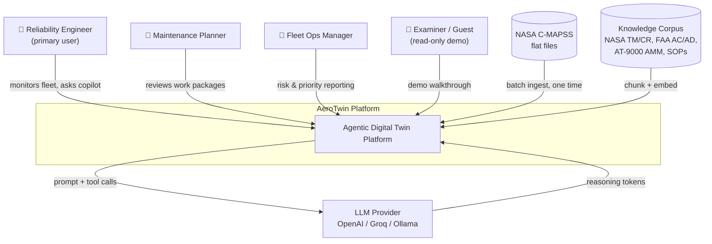
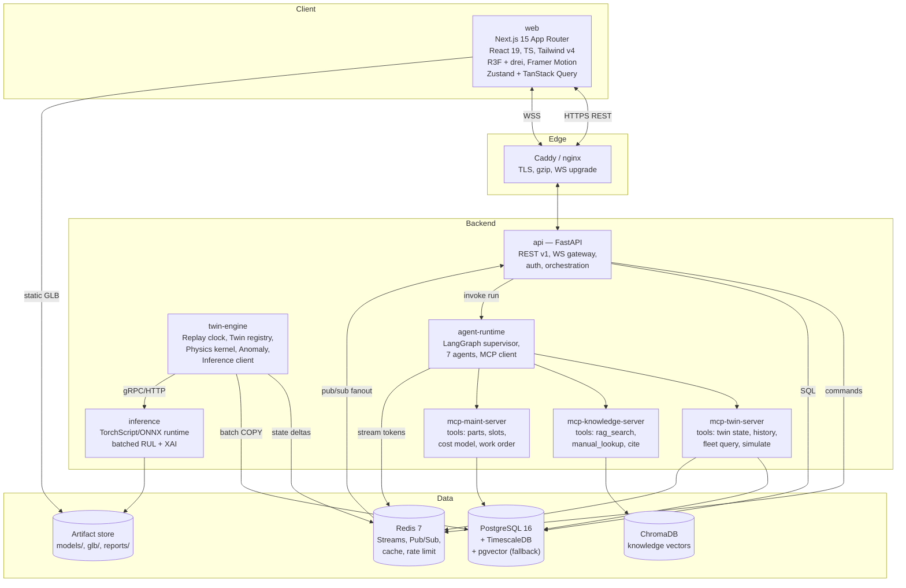
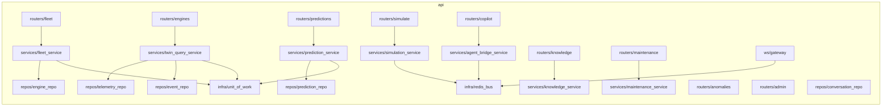
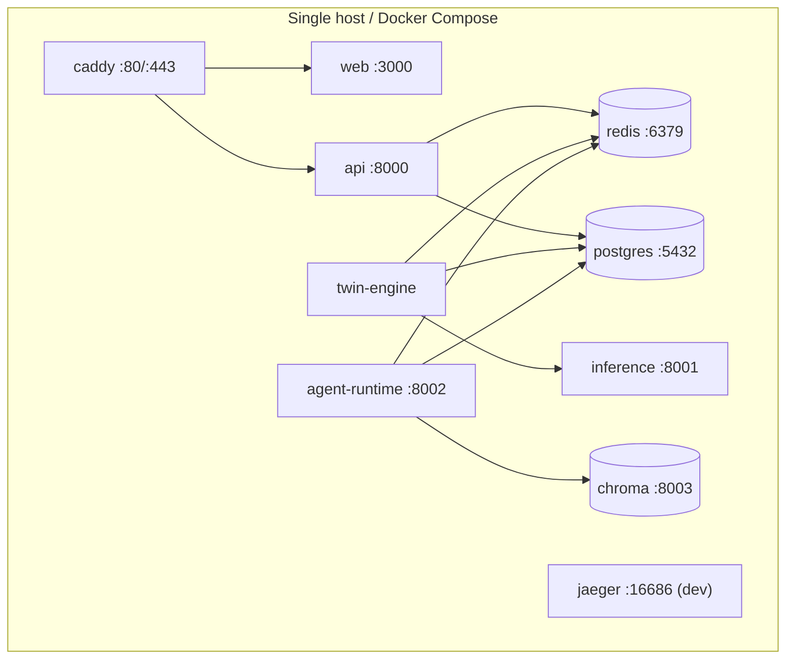

# 01 — Complete Software Architecture

## 1.1 Architectural style

**Modular monolith backend + event-driven streaming core + separate agent runtime + SPA-ish Next.js frontend.**

Why not microservices: a capstone graded on coherence benefits from one deployable API with strict
internal module boundaries (enforced by import-linter). Why not a plain monolith: the **stream
engine**, the **inference server**, and the **agent runtime** have fundamentally different latency,
CPU, and failure profiles, so they are separate processes from day one.

Four runtime processes + four backing stores:

```
┌──────────────────┐  ┌──────────────────┐  ┌──────────────────┐  ┌──────────────────┐
│  api             │  │  twin-engine     │  │  agent-runtime   │  │  web             │
│  FastAPI/uvicorn │  │  asyncio worker  │  │  LangGraph+MCP   │  │  Next.js 15      │
│  REST + WS edge  │  │  replay + twins  │  │  7 agents        │  │  React 19 + R3F  │
└────────┬─────────┘  └────────┬─────────┘  └────────┬─────────┘  └────────┬─────────┘
         │                     │                     │                     │
         └──────────┬──────────┴──────────┬──────────┘                     │
                    │                     │                                │
        ┌───────────▼──────────┐ ┌────────▼─────────┐            ┌─────────▼────────┐
        │ Redis (bus+cache+RT) │ │ Postgres/Timescale│           │  Browser         │
        └──────────────────────┘ └──────────────────┘            └──────────────────┘
                    │
        ┌───────────▼──────────┐   ┌──────────────────┐
        │ ChromaDB (vectors)   │   │ MinIO/local FS   │  model artifacts, GLB assets
        └──────────────────────┘   └──────────────────┘
```

---

## 1.2 C4 Level 1 — System Context



---

## 1.3 C4 Level 2 — Container diagram



---

## 1.4 C4 Level 3 — Component view of `api`



**Strict layering (enforced by `import-linter` contracts in CI):**

```
routers  →  services  →  repos  →  infra
   ↓           ↓           ↓
 schemas ← domain models (pure, no I/O)
```
Illegal: `routers → repos`, `repos → services`, `domain → anything`.

---

## 1.5 Runtime processes and their contracts

| Process | Language/Runtime | Concurrency | Scales by | Restart safety |
|---------|------------------|-------------|-----------|----------------|
| `api` | Python 3.12, uvicorn | async, 4 workers | horizontal (stateless) | fully stateless; WS clients reconnect |
| `twin-engine` | Python 3.12, asyncio | single-writer per shard | shard by `unit_id % N` | rehydrates twins from `twin_snapshots` + event replay |
| `inference` | Python 3.12, TorchScript | thread pool + micro-batching | horizontal | stateless |
| `agent-runtime` | Python 3.12, LangGraph | task pool, bounded | horizontal | checkpointed graph state in Postgres |
| `web` | Node 22, Next.js | — | horizontal | — |
| `mcp-*` | Python 3.12, MCP stdio/HTTP | async | co-located with agent-runtime | stateless |

**Single-writer rule:** only `twin-engine` mutates twin state. `api` issues *commands* onto a Redis
Stream; twin-engine consumes them. This eliminates the entire class of concurrent-mutation bugs and
makes the event log authoritative.

---

## 1.6 Communication matrix

| From → To | Mechanism | Payload | Sync? |
|-----------|-----------|---------|-------|
| web → api | HTTPS REST /api/v1 | JSON (OpenAPI-typed) | sync |
| web ↔ api | WSS /ws/v1/{channel} | Envelope JSON (Doc 13) | async |
| api → twin-engine | Redis Stream `cmd.twin` | `TwinCommand` | async, at-least-once |
| twin-engine → api | Redis Pub/Sub `evt.twin.{unit}` , `evt.fleet` | `TwinDelta`, `FleetSummary` | async, at-most-once |
| twin-engine → inference | HTTP/1.1 keep-alive (localhost) | batched tensors (msgpack) | sync, 50 ms timeout |
| api → agent-runtime | Redis Stream `cmd.agent` + Postgres run row | `AgentRunRequest` | async |
| agent-runtime → api | Redis Pub/Sub `evt.agent.{run_id}` | token deltas, step events | async |
| agent-runtime → mcp-* | MCP over stdio (dev) / HTTP+SSE (docker) | JSON-RPC 2.0 | sync |
| any → Postgres | asyncpg / SQLAlchemy 2 async | SQL | sync |
| ingest → Postgres | psycopg COPY | CSV binary | sync |

---

## 1.7 Technology decisions (ADR summary)

Full ADRs live in `docs/adr/`. Summary table:

| ADR | Decision | Alternatives rejected | Rationale |
|-----|----------|----------------------|-----------|
| ADR-001 | **Modular monolith + 3 sidecar processes** | full microservices; single process | Boundary clarity without ops overhead; different latency profiles isolated |
| ADR-002 | **Redis Streams as internal bus** | Kafka, RabbitMQ, NATS | Already need Redis for cache/pubsub; Streams give consumer groups + replay; zero extra container |
| ADR-003 | **TimescaleDB hypertable for telemetry** | plain Postgres, InfluxDB, Parquet | Continuous aggregates give free 1-min/1-hr rollups for charts; stays SQL |
| ADR-004 | **Event sourcing for twin state, snapshot every 50 cycles** | CRUD state row | Timeline, replay, audit, simulation forking all fall out for free (P2) |
| ADR-005 | **ChromaDB for vectors** | pgvector, Qdrant, Weaviate | Simplest local persistence + first-class LangChain retriever; pgvector kept as fallback adapter |
| ADR-006 | **LangGraph supervisor + specialists** | ReAct single agent, CrewAI, AutoGen | Explicit typed state graph = deterministic, testable, visualizable topology; matches "multi-agent" requirement demonstrably |
| ADR-007 | **MCP as the only tool boundary** | direct Python function tools | Tools become independently testable servers; satisfies MCP requirement authentically; enforces P3 |
| ADR-008 | **PyTorch + TorchScript export, ONNX optional** | serve raw nn.Module, TF | Decouples training deps from serving container; deterministic latency |
| ADR-009 | **Next.js App Router, mostly client components** | Vite SPA, Remix | Route groups + layouts + streaming SSR for static shell; R3F needs client anyway |
| ADR-010 | **Zustand (client/RT state) + TanStack Query (server state)** | Redux Toolkit, Jotai, Recoil | Clean split; WS deltas hit Zustand at 60 Hz without re-rendering Query cache |
| ADR-011 | **Tailwind v4 + custom design tokens + Radix primitives** | MUI, Chakra, shadcn wholesale | Full control of the Linear/Stripe aesthetic; a11y from Radix |
| ADR-012 | **Piecewise-linear RUL labels, R_early = 125** | linear RUL | C-MAPSS literature standard; makes NFR-8 comparable to published SOTA |
| ADR-013 | **Sliding window 30 (FD001/3) / 20 (FD002/4)** | fixed 50 | Min test trajectory length in FD002 is 21 cycles; window must fit |
| ADR-014 | **Per-regime z-score normalization** | global min-max | Mandatory for 6-regime subsets; large accuracy delta |
| ADR-015 | **Provider-abstracted LLM with `none` mode** | hard OpenAI dep | NFR-10: demo must never fail live |
| ADR-016 | **Physics-informed component health from efficiency proxies** | arbitrary weighted sensor sum | R8: defensible to an aero examiner |

---

## 1.8 Cross-cutting concerns

### 1.8.1 Configuration
Pydantic `BaseSettings`, 12-factor. Precedence: env var → `.env` → defaults. One
`Settings` object, DI-injected, never imported globally at module scope (testability).
Profiles: `local`, `docker`, `ci`, `demo`.

### 1.8.2 Logging
`structlog` → JSON lines. Every log carries `trace_id`, `unit_id?`, `run_id?`, `component`.
Frontend errors ship to `/api/v1/telemetry/client-error`.

### 1.8.3 Tracing
OpenTelemetry SDK, OTLP exporter, Jaeger container in the dev profile. Spans across
`api → redis → twin-engine → inference` are stitched by a `trace_id` propagated in the
command envelope. This is one of the strongest "industry-grade" signals in a viva.

### 1.8.4 Error model
RFC 9457 Problem Details. Single `AppError` hierarchy → exception handlers → typed
`ProblemDetail` responses. Error codes are enumerated in Doc 12 §12.9.

### 1.8.5 Security
- JWT (access 15 min / refresh 7 d), argon2id password hashing.
- Roles: `viewer`, `engineer`, `planner`, `admin`. Route-level dependency guard.
- WS auth: short-lived ticket obtained via REST, passed as first frame (never in query string logs).
- Rate limits (Redis token bucket): copilot 20/min/user, simulate 10/min/user, REST 300/min.
- Prompt-injection defense: RAG chunks are wrapped in delimiters and the system prompt declares
  retrieved content as untrusted data; tool-call arguments are schema-validated before execution.

### 1.8.6 Time
All timestamps UTC, ISO-8601 with `Z`. The **replay clock** is a separate logical clock; every
event carries both `wall_ts` and `cycle`.

---

## 1.9 Deployment topology

**Dev (`docker-compose.dev.yml`)** — hot reload everywhere, Jaeger + pgAdmin + RedisInsight.
**Demo (`docker-compose.yml`)** — 8 services, prebuilt images, seeded volume, one command.
**CI (GitHub Actions)** — lint → typecheck → unit → integration (testcontainers) → build → e2e (Playwright) → image push.



Resource budget for a laptop demo: ~4.5 GB RAM, 4 vCPU. Documented in Doc 16 §16.12.

---

## 1.10 Quality attribute scenarios

| Attribute | Scenario | Response measure |
|-----------|----------|------------------|
| Performance | 260 twins ticking at 8× while 5 clients watch fleet + 2 watch 3D detail | p99 tick 120 ms, UI 55 FPS |
| Scalability | Add 2nd twin-engine shard | linear throughput, no code change (shard by unit_id) |
| Availability | LLM provider 503s | Copilot degrades to deterministic template answer + banner, no 5xx to user |
| Modifiability | Swap Transformer → Informer as production model | one registry pointer change, zero API change |
| Testability | Twin logic | pure functions over `(state, telemetry) → (state', events)`; 100 % unit-testable without I/O |
| Observability | "Why did engine 42 go critical at 14:03?" | one Jaeger trace + one event-log query answers it |
| Security | Malicious copilot prompt tries `DROP TABLE` | MCP tool schema rejects; no raw SQL tool exists |
