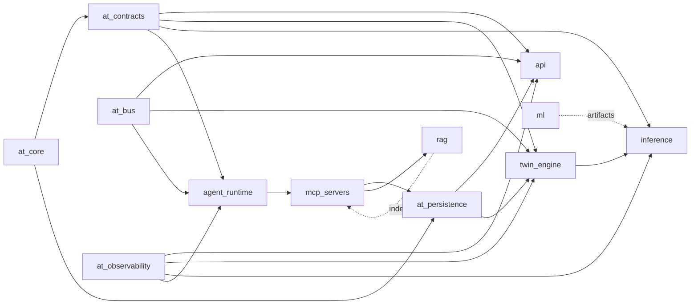

# 03 — Module Breakdown

Format per module: **responsibility · public contract · depends on · key invariants · test strategy**.

---

## 3.1 `libs/at_core` — Domain kernel (pure, zero I/O)

| Sub-module | Responsibility | Key types |
|---|---|---|
| `domain/engine` | Engine identity & static spec | `EngineId`, `EngineSpec(subset, model="AT-9000", install_date, tail_id)` |
| `domain/twin` | Twin aggregate state | `TwinState`, `TwinStatus{IDLE,RUNNING,PAUSED,FAILED,RETIRED,MAINTENANCE}`, `TwinSnapshot` |
| `domain/health` | Health scoring value objects | `HealthIndex(0-100)`, `HealthBand{HEALTHY,WATCH,WARNING,CRITICAL}`, `ComponentHealth{module→score}` |
| `domain/maintenance` | Work package model | `Severity`, `MaintenanceAction`, `WorkPackage`, `TaskCard` |
| `domain/fleet` | Fleet rollups | `FleetSummary`, `RiskTier`, `PriorityScore` |
| `events/` | Event registry + envelope | `DomainEvent(base)`, 22 concrete event types, `EventEnvelope` |
| `clock.py` | Replay clock abstraction | `ReplayClock(speed, t0)`, `VirtualCycle` |
| `errors.py` | Error hierarchy | `AppError` → `NotFound`, `Conflict`, `Validation`, `Upstream`, `Degraded` |

**Invariants:** immutable dataclasses (`frozen=True`, `slots=True`); no imports from `at_persistence`,
`at_bus`, or any service. **Test:** pure unit + Hypothesis property tests on state transitions.

**Health band thresholds (canonical, referenced everywhere):**
`HEALTHY ≥ 80`, `WATCH 60–79`, `WARNING 35–59`, `CRITICAL < 35`.

---

## 3.2 `libs/at_contracts` — Wire schemas
Pydantic v2 models for every REST body, WS envelope, MCP tool I/O, and inter-service command.
Single source for OpenAPI generation and for `pydantic→zod` codegen into `packages/ws-protocol`.
Versioned: `v1` package; breaking change ⇒ `v2` package, never in-place edit.

---

## 3.3 `libs/at_persistence`
SQLAlchemy 2.0 async models + Alembic migrations + `BaseRepository` (generic CRUD, `UnitOfWork`
context manager, `TimescaleRepository` mixin with time-bucket helpers). Owns *no* business logic.
**Test:** integration against a testcontainers Postgres+Timescale.

---

## 3.4 `libs/at_bus`
- `StreamProducer/StreamConsumer` over Redis Streams (consumer groups, XAUTOCLAIM for stuck messages, DLQ `at:dlq:*`).
- `PubSubPublisher/Subscriber` for fire-and-forget deltas.
- `Envelope{id, type, ts, trace_id, source, version, payload}`.
- Idempotency: consumers keep a Redis set of processed `envelope.id` (TTL 1 h).

---

## 3.5 `services/api`

| Module | Responsibility | Notes |
|---|---|---|
| `main.py` | App factory, lifespan (DB pool, Redis, warmup), middleware order: trace → cors → gzip → timing → auth → problem-details | |
| `routers/*` | HTTP surface only: validate → call service → map to response. No logic. | 11 routers, Doc 12 |
| `ws/gateway.py` | Connection lifecycle, ticket auth, channel subscribe/unsubscribe, heartbeat, backpressure | Doc 13 |
| `services/fleet_service` | Fleet listing, sorting, filtering, aggregates, priority scoring | Reads Redis hot cache first, PG fallback |
| `services/twin_query_service` | Single-twin reads: current state, timeline, history windows, component health | |
| `services/prediction_service` | Prediction history, model comparison view, calibration stats | |
| `services/simulation_service` | Validates scenario DSL, dispatches to twin-engine sandbox, polls result | |
| `services/agent_bridge_service` | Creates `agent_runs`, dispatches, relays token stream to WS, persists transcript | |
| `services/knowledge_service` | Document list, chunk preview, citation resolution, corpus stats | |
| `services/maintenance_service` | Work packages, approve/reject, schedule slots, cost rollup | |
| `security/*` | JWT issue/verify, RBAC dependency, WS ticket, rate limiter | |

---

## 3.6 `services/twin_engine` — the heart

| Module | Responsibility |
|---|---|
| `replay/clock.py` | Virtual clock: `speed ∈ {0.5,1,2,4,8,16,32}`, pause/resume/seek, drift-corrected `asyncio` loop |
| `replay/source.py` | `TelemetrySource` interface; `CmapssFileSource` (preloaded numpy per unit), `SyntheticSource`, future `KafkaSource` |
| `replay/cursor.py` | Per-unit cursor: current cycle, end-of-life handling, loop/retire/reseed policy |
| `registry.py` | `dict[EngineId, DigitalTwin]`, shard filter, rehydration from snapshot+events on boot |
| `twin.py` | **Pure aggregate**: `apply_telemetry(state, row) → (state', [events])`, `apply_command`, `to_snapshot` |
| `physics/efficiency.py` | Thermodynamic proxies: HPC efficiency index from `T30/T24` & `P30/P24`, turbine efficiency from `T50` & `Nc`, flow capacity from `W31/W32`, combustor from `phi`/`farB` |
| `physics/component_map.py` | Sensor→module attribution matrix (Doc 08 §8.5) |
| `health/index.py` | HI = weighted fusion of (normalized degradation trend, model RUL ratio, anomaly pressure, component minima), EWMA-smoothed, monotonic-decay constrained |
| `health/regime.py` | KMeans(6) on op settings, cached centroids from training |
| `anomaly/*` | Residual vs regime baseline → z-scores → EWMA + CUSUM change point + IsolationForest ensemble → `AnomalyEvent` with contributing sensors |
| `inference_client.py` | Micro-batches windows across twins each tick, single HTTP call, 50 ms timeout, circuit breaker, last-good fallback |
| `sim/sandbox.py` | Fork twin state, apply `ScenarioSpec`, roll forward N cycles with degradation model, return trajectory. **Never** publishes to live channels |
| `sim/scenario.py` | Scenario DSL: `{type: sensor_bias|regime_shift|maintenance_delay|cycle_extension, target, magnitude, start_cycle, duration}` |
| `persistence/writer.py` | Batched event + telemetry writer (COPY, flush every 500 rows or 1 s) |
| `persistence/snapshotter.py` | Snapshot every 50 cycles or on status change |
| `publisher.py` | Coalescing publisher: max 4 Hz/unit, delta-encoded, drops intermediate frames under load |

**Invariant:** `twin.py` contains no `await`, no I/O, no randomness (seeded RNG injected). This makes
the entire degradation logic unit-testable and deterministic — a major viva talking point.

---

## 3.7 `services/inference`

| Module | Responsibility |
|---|---|
| `runtime/loader.py` | Load TorchScript from registry by `model_id`, warm up, hold N models for A/B |
| `runtime/batcher.py` | Adaptive micro-batching (max 64, max wait 8 ms) |
| `preprocess/` | Apply persisted per-regime scaler, assemble `(B, W, F)` window tensor, handle short trajectories with edge padding + `mask` |
| `explain/ig.py` | Integrated Gradients (50 steps) → per-(timestep, sensor) attribution → aggregated to top-k sensors |
| `explain/shap_kernel.py` | Offline/on-demand KernelSHAP for deep-dive explanations (cached) |
| `explain/attention.py` | Attention rollout for Transformer/Informer → temporal saliency |
| `uncertainty.py` | MC-dropout (T=30) or ensemble variance → `rul_p10/p50/p90`; conformal calibration on val set |

**Response contract:** `{rul_p50, rul_p10, rul_p90, failure_prob_30/60/90, attributions[], model_id, latency_ms}`.

---

## 3.8 `services/agent_runtime`

| Module | Responsibility |
|---|---|
| `graph/state.py` | `AgentState` TypedDict: `query, intent, entities, plan, evidence[], tool_calls[], drafts{}, citations[], answer, confidence, errors[], budget` |
| `graph/nodes.py` | One node per agent + `router`, `synthesizer`, `critic`, `finalizer` |
| `graph/edges.py` | Conditional routing function, max 2 critic loops |
| `graph/checkpointer.py` | Postgres checkpointer → resumable runs, full trace persistence |
| `agents/*` | Seven agents (Doc 09) |
| `llm/provider.py` | `LLMProvider` protocol; `OpenAIProvider`, `GroqProvider`, `OllamaProvider`, `NullProvider` |
| `llm/cache.py` | Redis cache keyed by `sha256(model+prompt+tools)`, TTL 1 h |
| `llm/budget.py` | Per-run token + wall-clock budget; raises `BudgetExceeded` → graceful finalize |
| `prompts/` | Versioned markdown templates, `PromptRegistry.get("diagnosis", "v3")`, hash logged per run |
| `memory/` | Conversation buffer (last 10 turns), rolling summary, entity memory (engine facts mentioned) |
| `guards/` | Input: injection heuristics. Output: JSON-schema validation, citation-existence check, numeric-claim cross-check against tool outputs |
| `streaming.py` | Emits `agent.step.started/finished`, `agent.token`, `agent.run.completed` to Redis |

---

## 3.9 `services/mcp_servers`

**twin_server** (9 tools): `get_twin_state`, `get_sensor_history`, `get_component_health`,
`get_prediction`, `get_prediction_history`, `get_anomalies`, `query_fleet`, `compare_engines`,
`run_simulation`.

**knowledge_server** (5 tools): `rag_search`, `manual_lookup(section)`, `list_sources`,
`get_chunk(id)`, `find_procedure(fault_code)`.

**maintenance_server** (6 tools): `lookup_part`, `get_maintenance_slots`, `estimate_cost`,
`get_task_card`, `create_work_package`, `check_regulatory_requirement`.

Each tool: JSON-Schema in/out, ≤ 2 s budget, read-only unless explicitly `mutating: true`
(only `create_work_package`, which writes a **draft** requiring human approval).

---

## 3.10 `ml/` modules
`data` (load, piecewise labels, regime clustering, windowing, splits) · `features` (per-regime scaler,
Savitzky-Golay smoothing, rolling stats, deltas) · `models` (LSTM, TCN, Transformer, Informer, +
RandomForest/XGBoost/CNN baselines) · `train` (Trainer with AMP, cosine schedule, early stop,
5-fold CV, seed sweep) · `eval` (RMSE, NASA score, MAE, R², per-unit last-cycle error, PICP for
intervals) · `uncertainty` · `explain` · `export` (TorchScript + registry entry + auto model card).

---

## 3.11 `rag/` modules
`ingest` (PyMuPDF/unstructured, OCR fallback) · `chunk` (heading-aware, 512 tok / 64 overlap, tables
kept intact as markdown) · `embed` (`BAAI/bge-base-en-v1.5`, 768-d) · `index` (Chroma collections:
`manuals`, `regulatory`, `nasa_research`, `procedures`, `fleet_history`) · `retrieve` (BM25 + dense
hybrid, RRF fusion, `bge-reranker-base` cross-encoder top-20→top-5, metadata filters) · `eval` (ragas
faithfulness/relevancy + custom citation precision).

---

## 3.12 Frontend modules (`apps/web/features/*`)
`fleet` (grid, table, filters, sort, risk matrix, map-less geo strip) · `engine` (3D canvas, sensor
panel, timeline, component tree, prediction card, XAI panel) · `copilot` (chat, streaming, tool-call
trace viewer, citation chips, suggested prompts) · `simulation` (scenario builder, comparison charts,
delta summary) · `knowledge` (search, doc viewer, highlight) · `maintenance` (work package board,
approval flow) · `admin` (replay controls, model registry, system health).

---

## 3.13 Module dependency graph

No cycles. Enforced by `import-linter` layered contract in CI.
