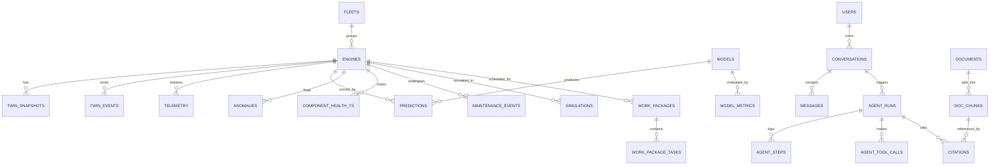

# 04 — Database Schema

Stores: **PostgreSQL 16 + TimescaleDB** (system of record), **Redis 7** (hot state, bus, cache),
**ChromaDB** (vectors), **filesystem/MinIO** (model + 3D artifacts).

---

## 4.1 ER overview



---

## 4.2 Core DDL

```sql
CREATE EXTENSION IF NOT EXISTS timescaledb;
CREATE EXTENSION IF NOT EXISTS pg_trgm;
CREATE EXTENSION IF NOT EXISTS "uuid-ossp";

-- ── Reference ────────────────────────────────────────────────────────────────
CREATE TYPE cmapss_subset  AS ENUM ('FD001','FD002','FD003','FD004');
CREATE TYPE twin_status    AS ENUM ('IDLE','RUNNING','PAUSED','MAINTENANCE','FAILED','RETIRED');
CREATE TYPE health_band    AS ENUM ('HEALTHY','WATCH','WARNING','CRITICAL');
CREATE TYPE severity       AS ENUM ('INFO','LOW','MEDIUM','HIGH','CRITICAL');
CREATE TYPE engine_module  AS ENUM ('FAN','LPC','HPC','COMBUSTOR','HPT','LPT','NOZZLE','BEARINGS','CONTROL');
CREATE TYPE model_stage    AS ENUM ('DEV','STAGING','PRODUCTION','ARCHIVED');
CREATE TYPE wp_status      AS ENUM ('DRAFT','PROPOSED','APPROVED','SCHEDULED','IN_PROGRESS','COMPLETED','REJECTED');

CREATE TABLE fleets (
  id           UUID PRIMARY KEY DEFAULT gen_random_uuid(),
  name         TEXT NOT NULL UNIQUE,
  operator     TEXT NOT NULL DEFAULT 'AeroTwin Airlines',
  base_airport TEXT,
  created_at   TIMESTAMPTZ NOT NULL DEFAULT now()
);

CREATE TABLE engines (
  id              UUID PRIMARY KEY DEFAULT gen_random_uuid(),
  fleet_id        UUID REFERENCES fleets(id) ON DELETE SET NULL,
  unit_number     INT  NOT NULL,
  subset          cmapss_subset NOT NULL,
  split           TEXT NOT NULL CHECK (split IN ('train','test')),
  external_ref    TEXT GENERATED ALWAYS AS (subset::text || '-' || split || '-U' || unit_number) STORED,
  tail_number     TEXT,
  engine_model    TEXT NOT NULL DEFAULT 'AT-9000',
  install_date    DATE,
  total_cycles    INT  NOT NULL DEFAULT 0,          -- length of trajectory
  true_rul        INT,                              -- known ground truth (test set)
  created_at      TIMESTAMPTZ NOT NULL DEFAULT now(),
  UNIQUE (subset, split, unit_number)
);
CREATE INDEX idx_engines_fleet ON engines(fleet_id);
CREATE INDEX idx_engines_ref   ON engines USING gin (external_ref gin_trgm_ops);

-- ── Telemetry (hypertable) ───────────────────────────────────────────────────
CREATE TABLE telemetry (
  engine_id   UUID        NOT NULL REFERENCES engines(id) ON DELETE CASCADE,
  ts          TIMESTAMPTZ NOT NULL,      -- wall clock of replay
  cycle       INT         NOT NULL,      -- virtual engine cycle
  regime      SMALLINT,                  -- 0..5
  op1 REAL, op2 REAL, op3 REAL,
  s1 REAL, s2 REAL, s3 REAL, s4 REAL, s5 REAL, s6 REAL, s7 REAL,
  s8 REAL, s9 REAL, s10 REAL, s11 REAL, s12 REAL, s13 REAL, s14 REAL,
  s15 REAL, s16 REAL, s17 REAL, s18 REAL, s19 REAL, s20 REAL, s21 REAL,
  PRIMARY KEY (engine_id, cycle)
);
SELECT create_hypertable('telemetry','ts', chunk_time_interval => INTERVAL '1 day');
CREATE INDEX idx_tel_engine_ts ON telemetry (engine_id, ts DESC);
ALTER TABLE telemetry SET (timescaledb.compress, timescaledb.compress_segmentby='engine_id');
SELECT add_compression_policy('telemetry', INTERVAL '2 days');
SELECT add_retention_policy ('telemetry', INTERVAL '30 days');

-- 1-minute continuous aggregate powering charts
CREATE MATERIALIZED VIEW telemetry_1m
WITH (timescaledb.continuous) AS
SELECT engine_id,
       time_bucket('1 minute', ts) AS bucket,
       max(cycle) AS cycle,
       avg(s2) AS s2_avg, avg(s3) AS s3_avg, avg(s4) AS s4_avg,
       avg(s7) AS s7_avg, avg(s11) AS s11_avg, avg(s12) AS s12_avg,
       avg(s15) AS s15_avg, avg(s20) AS s20_avg, avg(s21) AS s21_avg
FROM telemetry GROUP BY engine_id, bucket;
SELECT add_continuous_aggregate_policy('telemetry_1m',
  start_offset => INTERVAL '1 hour', end_offset => INTERVAL '1 minute',
  schedule_interval => INTERVAL '1 minute');

-- ── Twin state ───────────────────────────────────────────────────────────────
CREATE TABLE twin_events (
  id          BIGSERIAL,
  engine_id   UUID NOT NULL REFERENCES engines(id) ON DELETE CASCADE,
  ts          TIMESTAMPTZ NOT NULL DEFAULT now(),
  cycle       INT  NOT NULL,
  seq         BIGINT NOT NULL,                 -- per-engine monotonic
  event_type  TEXT NOT NULL,                   -- 'twin.health.degraded' etc.
  severity    severity NOT NULL DEFAULT 'INFO',
  payload     JSONB NOT NULL,
  trace_id    TEXT,
  PRIMARY KEY (engine_id, seq)
);
SELECT create_hypertable('twin_events','ts', chunk_time_interval => INTERVAL '7 days');
CREATE INDEX idx_events_type ON twin_events (event_type, ts DESC);
CREATE INDEX idx_events_payload ON twin_events USING gin (payload jsonb_path_ops);

CREATE TABLE twin_snapshots (
  id              UUID PRIMARY KEY DEFAULT gen_random_uuid(),
  engine_id       UUID NOT NULL REFERENCES engines(id) ON DELETE CASCADE,
  cycle           INT  NOT NULL,
  seq             BIGINT NOT NULL,
  status          twin_status NOT NULL,
  health_index    REAL NOT NULL CHECK (health_index BETWEEN 0 AND 100),
  health_band     health_band NOT NULL,
  rul_p50         REAL, rul_p10 REAL, rul_p90 REAL,
  failure_prob_30 REAL, failure_prob_60 REAL, failure_prob_90 REAL,
  regime          SMALLINT,
  component_health JSONB NOT NULL,   -- {"HPC": 62.4, "FAN": 88.1, ...}
  sensor_snapshot  JSONB NOT NULL,
  anomaly_score    REAL,
  created_at      TIMESTAMPTZ NOT NULL DEFAULT now(),
  UNIQUE (engine_id, cycle)
);
CREATE INDEX idx_snap_latest ON twin_snapshots (engine_id, cycle DESC);

CREATE TABLE component_health_ts (
  engine_id UUID NOT NULL REFERENCES engines(id) ON DELETE CASCADE,
  ts        TIMESTAMPTZ NOT NULL,
  cycle     INT NOT NULL,
  module    engine_module NOT NULL,
  score     REAL NOT NULL,
  degradation_rate REAL,
  PRIMARY KEY (engine_id, cycle, module)
);
SELECT create_hypertable('component_health_ts','ts', chunk_time_interval => INTERVAL '7 days');

-- ── ML ───────────────────────────────────────────────────────────────────────
CREATE TABLE models (
  id            UUID PRIMARY KEY DEFAULT gen_random_uuid(),
  name          TEXT NOT NULL,                 -- 'transformer-rul'
  version       TEXT NOT NULL,                 -- 'v1.3.0'
  architecture  TEXT NOT NULL,                 -- LSTM|TCN|TRANSFORMER|INFORMER|ENSEMBLE
  subset        cmapss_subset NOT NULL,
  stage         model_stage NOT NULL DEFAULT 'DEV',
  artifact_uri  TEXT NOT NULL,
  artifact_sha  TEXT NOT NULL,
  window_size   INT NOT NULL,
  feature_set   JSONB NOT NULL,
  hyperparams   JSONB NOT NULL,
  train_seed    INT,
  trained_at    TIMESTAMPTZ NOT NULL,
  created_at    TIMESTAMPTZ NOT NULL DEFAULT now(),
  UNIQUE (name, version, subset)
);
CREATE UNIQUE INDEX one_prod_per_subset ON models (subset) WHERE stage = 'PRODUCTION';

CREATE TABLE model_metrics (
  id        UUID PRIMARY KEY DEFAULT gen_random_uuid(),
  model_id  UUID NOT NULL REFERENCES models(id) ON DELETE CASCADE,
  split     TEXT NOT NULL,                     -- val | test | cv-fold-3
  rmse REAL, mae REAL, nasa_score REAL, r2 REAL,
  picp_80 REAL, mpiw_80 REAL,                  -- interval coverage / width
  latency_p95_ms REAL,
  extra JSONB,
  created_at TIMESTAMPTZ NOT NULL DEFAULT now()
);

CREATE TABLE predictions (
  engine_id UUID NOT NULL REFERENCES engines(id) ON DELETE CASCADE,
  ts        TIMESTAMPTZ NOT NULL,
  cycle     INT NOT NULL,
  model_id  UUID NOT NULL REFERENCES models(id),
  rul_p50 REAL NOT NULL, rul_p10 REAL, rul_p90 REAL,
  failure_prob_30 REAL, failure_prob_60 REAL, failure_prob_90 REAL,
  attributions JSONB,        -- [{"sensor":"s11","value":0.184,"direction":"up"}...]
  latency_ms REAL,
  PRIMARY KEY (engine_id, cycle, model_id)
);
SELECT create_hypertable('predictions','ts', chunk_time_interval => INTERVAL '7 days');

CREATE TABLE anomalies (
  id UUID PRIMARY KEY DEFAULT gen_random_uuid(),
  engine_id UUID NOT NULL REFERENCES engines(id) ON DELETE CASCADE,
  detected_at TIMESTAMPTZ NOT NULL DEFAULT now(),
  cycle INT NOT NULL,
  detector TEXT NOT NULL,          -- 'ewma' | 'cusum' | 'iforest' | 'autoencoder'
  score REAL NOT NULL,
  severity severity NOT NULL,
  sensors JSONB NOT NULL,          -- contributing sensors + z-scores
  module engine_module,
  acknowledged_by UUID, acknowledged_at TIMESTAMPTZ,
  resolved BOOLEAN NOT NULL DEFAULT false
);
CREATE INDEX idx_anom_engine ON anomalies (engine_id, detected_at DESC);
CREATE INDEX idx_anom_open   ON anomalies (severity, detected_at DESC) WHERE NOT resolved;

-- ── Simulation ───────────────────────────────────────────────────────────────
CREATE TABLE simulations (
  id UUID PRIMARY KEY DEFAULT gen_random_uuid(),
  engine_id UUID NOT NULL REFERENCES engines(id) ON DELETE CASCADE,
  created_by UUID,
  base_cycle INT NOT NULL,
  scenario JSONB NOT NULL,
  horizon_cycles INT NOT NULL,
  status TEXT NOT NULL DEFAULT 'PENDING',     -- PENDING|RUNNING|DONE|FAILED
  baseline_result JSONB,
  scenario_result JSONB,
  delta_summary JSONB,
  error TEXT,
  created_at TIMESTAMPTZ NOT NULL DEFAULT now(),
  completed_at TIMESTAMPTZ
);

-- ── Maintenance ──────────────────────────────────────────────────────────────
CREATE TABLE work_packages (
  id UUID PRIMARY KEY DEFAULT gen_random_uuid(),
  engine_id UUID NOT NULL REFERENCES engines(id) ON DELETE CASCADE,
  status wp_status NOT NULL DEFAULT 'DRAFT',
  severity severity NOT NULL,
  title TEXT NOT NULL,
  rationale TEXT NOT NULL,
  recommended_by TEXT NOT NULL,          -- 'agent:maintenance_planner' | 'user:<id>'
  agent_run_id UUID,
  due_by_cycle INT,
  estimated_downtime_h REAL,
  estimated_cost_usd NUMERIC(12,2),
  approved_by UUID, approved_at TIMESTAMPTZ,
  created_at TIMESTAMPTZ NOT NULL DEFAULT now()
);

CREATE TABLE work_package_tasks (
  id UUID PRIMARY KEY DEFAULT gen_random_uuid(),
  work_package_id UUID NOT NULL REFERENCES work_packages(id) ON DELETE CASCADE,
  seq INT NOT NULL,
  task_code TEXT,                        -- AMM task ref e.g. '72-31-00-200-801'
  description TEXT NOT NULL,
  module engine_module,
  labor_hours REAL,
  parts JSONB,
  source_citation_id UUID
);

CREATE TABLE maintenance_events (
  id UUID PRIMARY KEY DEFAULT gen_random_uuid(),
  engine_id UUID NOT NULL REFERENCES engines(id) ON DELETE CASCADE,
  cycle INT NOT NULL, performed_at TIMESTAMPTZ NOT NULL DEFAULT now(),
  action TEXT NOT NULL, module engine_module,
  work_package_id UUID REFERENCES work_packages(id),
  health_before REAL, health_after REAL, notes TEXT
);

-- ── Knowledge / RAG ──────────────────────────────────────────────────────────
CREATE TABLE documents (
  id UUID PRIMARY KEY DEFAULT gen_random_uuid(),
  source_type TEXT NOT NULL,      -- NASA|FAA|AMM|SOP|INTERNAL
  title TEXT NOT NULL, publisher TEXT, doc_number TEXT, revision TEXT,
  uri TEXT NOT NULL, license TEXT, sha256 TEXT NOT NULL UNIQUE,
  page_count INT, ingested_at TIMESTAMPTZ NOT NULL DEFAULT now(),
  metadata JSONB
);

CREATE TABLE doc_chunks (
  id UUID PRIMARY KEY DEFAULT gen_random_uuid(),
  document_id UUID NOT NULL REFERENCES documents(id) ON DELETE CASCADE,
  chunk_index INT NOT NULL,
  section_path TEXT,              -- 'Ch.72 > 72-31 > Removal'
  page_from INT, page_to INT,
  content TEXT NOT NULL,
  token_count INT,
  embedding_id TEXT,              -- Chroma id
  tsv tsvector GENERATED ALWAYS AS (to_tsvector('english', content)) STORED,
  UNIQUE (document_id, chunk_index)
);
CREATE INDEX idx_chunk_fts ON doc_chunks USING gin (tsv);   -- BM25-ish hybrid leg

-- ── Agents & chat ────────────────────────────────────────────────────────────
CREATE TABLE users (
  id UUID PRIMARY KEY DEFAULT gen_random_uuid(),
  email CITEXT UNIQUE NOT NULL, password_hash TEXT NOT NULL,
  display_name TEXT, role TEXT NOT NULL DEFAULT 'engineer',
  created_at TIMESTAMPTZ NOT NULL DEFAULT now()
);

CREATE TABLE conversations (
  id UUID PRIMARY KEY DEFAULT gen_random_uuid(),
  user_id UUID REFERENCES users(id) ON DELETE SET NULL,
  engine_id UUID REFERENCES engines(id) ON DELETE SET NULL,
  title TEXT, summary TEXT,
  created_at TIMESTAMPTZ NOT NULL DEFAULT now(),
  updated_at TIMESTAMPTZ NOT NULL DEFAULT now()
);

CREATE TABLE messages (
  id UUID PRIMARY KEY DEFAULT gen_random_uuid(),
  conversation_id UUID NOT NULL REFERENCES conversations(id) ON DELETE CASCADE,
  role TEXT NOT NULL CHECK (role IN ('user','assistant','system','tool')),
  content TEXT NOT NULL,
  agent_run_id UUID,
  created_at TIMESTAMPTZ NOT NULL DEFAULT now()
);
CREATE INDEX idx_msg_conv ON messages (conversation_id, created_at);

CREATE TABLE agent_runs (
  id UUID PRIMARY KEY DEFAULT gen_random_uuid(),
  conversation_id UUID REFERENCES conversations(id) ON DELETE CASCADE,
  engine_id UUID REFERENCES engines(id) ON DELETE SET NULL,
  trigger TEXT NOT NULL,           -- 'user_query'|'auto_health'|'scheduled_fleet'
  intent TEXT,
  graph_version TEXT NOT NULL,
  status TEXT NOT NULL DEFAULT 'RUNNING',
  final_answer TEXT, confidence REAL,
  tokens_in INT, tokens_out INT, cost_usd NUMERIC(10,4),
  duration_ms INT, error TEXT,
  trace_id TEXT,
  started_at TIMESTAMPTZ NOT NULL DEFAULT now(), finished_at TIMESTAMPTZ
);

CREATE TABLE agent_steps (
  id UUID PRIMARY KEY DEFAULT gen_random_uuid(),
  run_id UUID NOT NULL REFERENCES agent_runs(id) ON DELETE CASCADE,
  seq INT NOT NULL, node TEXT NOT NULL, agent TEXT,
  input JSONB, output JSONB, prompt_version TEXT,
  tokens_in INT, tokens_out INT, duration_ms INT, error TEXT,
  UNIQUE (run_id, seq)
);

CREATE TABLE agent_tool_calls (
  id UUID PRIMARY KEY DEFAULT gen_random_uuid(),
  run_id UUID NOT NULL REFERENCES agent_runs(id) ON DELETE CASCADE,
  step_id UUID REFERENCES agent_steps(id) ON DELETE CASCADE,
  server TEXT NOT NULL, tool TEXT NOT NULL,
  arguments JSONB NOT NULL, result JSONB, ok BOOLEAN NOT NULL,
  duration_ms INT, created_at TIMESTAMPTZ NOT NULL DEFAULT now()
);

CREATE TABLE citations (
  id UUID PRIMARY KEY DEFAULT gen_random_uuid(),
  run_id UUID NOT NULL REFERENCES agent_runs(id) ON DELETE CASCADE,
  chunk_id UUID REFERENCES doc_chunks(id),
  quote TEXT, relevance REAL, position INT
);

-- LangGraph checkpointer tables are created by the library (`checkpoints`, `checkpoint_writes`).
```

---

## 4.3 Redis keyspace

| Key | Type | TTL | Purpose |
|---|---|---|---|
| `at:{env}:twin:{engine_id}:state` | Hash | — | Hot twin state (read path for fleet API) |
| `at:{env}:twin:{engine_id}:window` | List (cap W) | — | Last W sensor rows for inference windowing |
| `at:{env}:fleet:summary` | String (JSON) | 2 s | Cached fleet rollup |
| `at:{env}:fleet:rank:{criterion}` | Sorted Set | — | Pre-ranked fleet by health/risk/rul/priority |
| `at:{env}:stream:cmd.twin` | Stream | maxlen 100k | Commands to twin-engine |
| `at:{env}:stream:cmd.agent` | Stream | maxlen 10k | Agent run requests |
| `at:{env}:ps:evt.twin.{engine_id}` | Pub/Sub | — | Per-engine deltas |
| `at:{env}:ps:evt.fleet` | Pub/Sub | — | Fleet-level deltas |
| `at:{env}:ps:evt.agent.{run_id}` | Pub/Sub | — | Token/step stream |
| `at:{env}:ws:ticket:{ticket}` | String | 30 s | One-time WS auth ticket |
| `at:{env}:rl:{user}:{bucket}` | String | 60 s | Token bucket |
| `at:{env}:llmcache:{hash}` | String | 1 h | LLM response cache |
| `at:{env}:lock:shard:{n}` | String | 15 s | Twin-engine shard lease |
| `at:{env}:idem:{consumer}` | Set | 1 h | Processed envelope ids |

---

## 4.4 ChromaDB collections

| Collection | Embedding | Metadata keys |
|---|---|---|
| `manuals` | bge-base-en-v1.5 | `doc_id, chapter, ata_chapter, section_path, page, revision, module` |
| `regulatory` | same | `doc_id, authority(FAA/EASA), doc_number, effective_date, applicability` |
| `nasa_research` | same | `doc_id, report_number, year, topic` |
| `procedures` | same | `doc_id, task_code, module, fault_codes[], est_hours` |
| `fleet_history` | same | `engine_id, cycle_range, event_types[]` (synthesized narratives of past failures) |

Chroma stores vectors; **Postgres `doc_chunks` remains authoritative for text + citations** so the
UI can always resolve a citation even if the index is rebuilt.

---

## 4.5 Data lifecycle & sizing

| Data | Volume estimate (260 engines, 8 h demo @ 8×) | Policy |
|---|---|---|
| telemetry | ~2.4 M rows, ~450 MB uncompressed | compress @2 d, retain 30 d |
| twin_events | ~700 k rows | retain 90 d |
| predictions | ~2.4 M rows | retain 30 d, downsample to per-10-cycle after 7 d |
| snapshots | ~48 k rows | keep forever |
| agent_runs/steps | ~ thousands | keep forever |

Migrations: Alembic, one revision per milestone, `make db-upgrade`. Seed script populates fleets,
engines, models registry, users, and knowledge documents idempotently.
