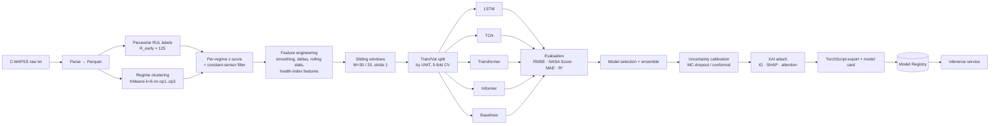

# 07 — AI / ML Pipeline

## 7.1 Pipeline overview

---

## 7.2 Data preparation

**Parsing.** Whitespace-delimited, 26 columns, no header. → Parquet with dtypes, one file per subset/split.

**Labels — piecewise linear (ADR-012):**
`RUL(t) = min(max_cycle_unit − t, 125)` for train; test labels come from `RUL_FD00X.txt` added to the
remaining trajectory. Rationale: degradation is negligible early, so a linear label injects label
noise; capping is the C-MAPSS literature standard and makes NFR-8 comparable to published results.

**Regime handling (ADR-014).** For FD002/FD004, KMeans(k=6) on `(op1,op2,op3)` recovers the six
flight conditions almost perfectly (silhouette > 0.95). Centroids are persisted and reused at
inference. Normalization is then **per-regime z-score**, which removes the condition-induced
variance that otherwise dominates the sensor signal. FD001/FD003 use a single global regime.

**Feature selection.** Drop sensors with per-regime variance below 1e-6 (FD001/FD003 → drops
s1,s5,s6,s10,s16,s18,s19 → 14 sensors). FD002/FD004 keep all 21 because regime variation makes them
informative. Feature set is recorded in the registry so serving can never mismatch.

**Engineered features (ablated in M4):**
| Feature | Definition | Motivation |
|---|---|---|
| `s_smooth` | Savitzky–Golay (win 7, poly 2) | denoise without lag of MA |
| `Δs` | first difference | degradation *rate* |
| `roll_mean/std_5,10` | rolling stats | local trend + volatility |
| `cycle_norm` | `t / max_train_len` | age prior |
| `regime_onehot` | 6-d | explicit condition context |
| `hpc_eff_proxy` | `T30/T24` normalized | physics-informed (see Doc 08 §8.4) |
| `turb_eff_proxy` | `T50 / (Nc·k)` | physics-informed |
| `flow_proxy` | `W31 + W32` | cooling-flow drift |

**Windowing.** `W = 30` for FD001/FD003, `W = 20` for FD002, `W = 18` for FD004 (ADR-013 as amended in M2). The constraint is the shortest *test* trajectory, which measurement showed to be 21 cycles for FD002 but **19** for FD004 — at W=20 two FD004 units could not be scored at all.
Stride 1 in training. Test: last window per unit (the standard protocol). Short trajectories are
edge-padded with a validity `mask` that the models consume.

**Splits.** Grouped by `unit_number` — **never** random row splits (leakage). 5-fold GroupKFold for
CV, plus the official held-out test set for the headline number.

---

## 7.3 Models

All models take `(B, W, F)` → scalar RUL. Trained with Huber loss (δ=5) — more robust than MSE to
the label cap discontinuity. AdamW, cosine schedule w/ warmup, AMP, grad clip 1.0, early stop on
val NASA score, 3 seeds each.

### 7.3.1 Baselines (must exist — they prove the deep models earn their keep)
- Ridge on last-window flattened features
- Random Forest / XGBoost on hand features (rolling stats + slopes)
- 1D-CNN (2 conv blocks + GAP)
Expected FD001 RMSE ≈ 18–22.

### 7.3.2 LSTM (reference deep model)
2-layer bidirectional LSTM, hidden 128, dropout 0.3, attention-pooled output head
(learned query over timesteps) → MLP(64) → 1. ~420 k params. Expected FD001 RMSE ≈ 13.5–15.

### 7.3.3 Temporal Convolutional Network
6 dilated residual blocks, dilations `1,2,4,8,16,32` (receptive field 63 ≥ W), 64 channels, weight
norm, causal, dropout 0.2, GAP head. Fast, very stable. Expected FD001 RMSE ≈ 12.8–14.

### 7.3.4 Transformer encoder
d_model 128, 4 heads, 3 layers, FFN 256, learned positional embedding, pre-LN, dropout 0.25,
`[CLS]`-style learned token for pooling. Heavily regularized because C-MAPSS is small (R3).
Expected FD001 RMSE ≈ 12.5–14.

### 7.3.5 Informer-style
ProbSparse self-attention (top-u queries, u = c·ln L), distilling conv between layers, 3 encoder
layers. On W=30 the efficiency win is theoretical, so the honest framing in the report is: *"Informer
is evaluated to test whether sparse attention regularizes better on short sequences; we report the
result whatever it shows."* That intellectual honesty scores better than a fake win.

### 7.3.6 Ensemble
Weighted average of the top-3 by val NASA score, weights from a non-negative least squares fit on
validation. Typically buys 3–6 % RMSE. Also gives ensemble-variance uncertainty for free.

---

## 7.4 Evaluation

**Metrics.** RMSE (primary), NASA asymmetric score
`S = Σ exp(−d/13)−1 if d<0 else exp(d/10)−1`, `d = RUL_pred − RUL_true` (late predictions punished
harder — the safety-critical framing), MAE, R², and:
- **Per-horizon RMSE** bucketed by true RUL (0–25, 26–50, 51–100, >100) — reveals whether the model
  is actually good *near failure*, which is the only part that matters operationally.
- **PICP/MPIW** for the 80 % interval (calibration).
- **Lead-time analysis:** how many cycles before failure does the model first predict RUL < 30?

**Reporting.** `docs/reports/model-comparison.md` with a table across all 4 subsets × 6 models ×
3 seeds (mean ± std), plus per-unit degradation curves for the 6 best/worst units and an error
analysis section. Also a **model card** per registered model (intended use, data, metrics,
limitations, ethical/safety notes).

Target (NFR-8): FD001 RMSE ≤ 14.0, NASA score ≤ 350.

---

## 7.5 Uncertainty
- **MC-dropout** (T=30) at inference for the selected model → `μ, σ`.
- **Deep ensemble** variance when the ensemble is production.
- **Conformal calibration** on the validation set → distribution-free 80 % intervals
  `[p10, p90]`, which is what the UI actually plots as the confidence band.
- Failure probability: `P(RUL < h)` for h ∈ {30, 60, 90} from the calibrated predictive distribution.

---

## 7.6 Anomaly detection (separate from RUL)

Three complementary detectors, fused:

| Detector | Input | Catches |
|---|---|---|
| **Residual z-score + EWMA** | sensor − regime-conditional nominal baseline (fitted on first 20 % of healthy cycles) | slow drift |
| **CUSUM** | same residual stream | abrupt change points |
| **LSTM/Conv Autoencoder** | window reconstruction error, trained on healthy windows only | multivariate correlation breaks |
| *(optional)* IsolationForest | engineered feature vector | outlier regimes |

Fusion: `anomaly_score = max(normalized detector scores)`; severity thresholds at 2σ/3σ/4σ.
Every anomaly carries **contributing sensors** (top reconstruction-error dims / largest z-scores) →
mapped to an `engine_module` → drives the 3D hotspot and the Diagnosis agent.

Evaluation: since C-MAPSS has no anomaly labels, we evaluate by (a) **lead time** before end-of-life,
(b) **false-positive rate on the healthy first 30 %** of each trajectory, (c) precision of module
attribution against the known fault mode (HPC for FD001/2; HPC+Fan for FD003/4). This is a
defensible, honest protocol and is documented as such.

---

## 7.7 Explainable AI

| Method | When | Output |
|---|---|---|
| **Integrated Gradients** | every 10 cycles / band change, online | `(W × F)` attribution → aggregated top-k sensors + temporal saliency |
| **KernelSHAP** | on demand from the UI ("Explain deeply"), cached | Shapley values with additivity guarantee |
| **Attention rollout** | Transformer/Informer only | which cycles the model attended to |
| **Counterfactual probe** | simulation feature | "if s11 had stayed at baseline, RUL would be X" |
| **Global importance** | offline, in the report | permutation importance across the test set |

UI surface (`XaiPanel`): horizontal bar chart of top-8 sensors with direction arrows, a temporal
saliency heatstrip over the window, a plain-language sentence generated by the template engine
(*not* the LLM, so it's always available), and the module attribution that lights the 3D model.
Every attribution vector is persisted in `predictions.attributions` (P9).

---

## 7.8 Training infrastructure & MLOps

- **Hydra** configs (`ml/src/at_ml/config/`): `experiment=transformer_fd001 seed=42`.
- **Experiment tracking:** MLflow local (or a JSONL tracker fallback so nothing breaks offline).
- **Determinism:** seeded torch/numpy/python, `torch.use_deterministic_algorithms(True)` where
  possible, seed recorded in registry.
- **Registry** (`models/registry.json` + `models` table): `model_id, name, version, arch, subset,
  stage, artifact_uri, sha256, window, feature_set, hyperparams, metrics, trained_at`.
- **Promotion gate:** `DEV → STAGING` requires CV complete; `STAGING → PRODUCTION` requires
  test RMSE ≤ incumbent and latency p95 ≤ 15 ms. Enforced by `model_promoter` worker.
- **CI:** `model-train.yml` (manual dispatch) trains, evaluates, writes the card, opens a PR with
  the registry diff. Smoke test in normal CI loads the production TorchScript and asserts output
  shape + a golden prediction within tolerance.
- **Drift monitoring** (stretch, M12): PSI between live feature distributions and training
  reference → `model.drift.detected` event → Fleet agent raises it.

---

## 7.9 RAG pipeline (detail; see also Doc 09)

**Corpus (R6-safe):** public NASA technical reports on C-MAPSS/PHM & turbofan degradation; FAA
Advisory Circulars (AC 43-xx, AC 120-xx), 14 CFR Part 43/145 excerpts, sample ADs; EASA public
guidance; **a fictional "AT-9000 Aircraft Maintenance Manual"** authored by us in ATA-chapter format
(Ch. 71 Powerplant, 72 Engine, 73 Fuel, 75 Air, 77 Indicating, 79 Oil) with realistic task cards;
plus synthesized fleet-history narratives. Every doc has a `manifest.yaml` entry with license.

**Chunking:** heading/section-aware, 512 tokens, 64 overlap; tables preserved as markdown and never
split; each chunk keeps `section_path`, page range, ATA chapter, and module tags.

**Embedding:** `BAAI/bge-base-en-v1.5` (768-d) with the `Represent this sentence...` query prefix.

**Retrieval:** hybrid — Postgres FTS (BM25-ish) ∪ Chroma dense, fused with Reciprocal Rank Fusion,
then `bge-reranker-base` cross-encoder rerank top-20 → top-5, with metadata pre-filters
(`module`, `source_type`, `ata_chapter`) supplied by the calling agent.

**Grounding contract:** the answer may only assert manual/regulatory facts that appear in a
retrieved chunk; the output guard verifies every `[n]` citation resolves to a chunk actually in the
evidence set, else the claim is stripped and flagged. Measured as citation precision (NFR-7).

**Eval:** 40 golden Q/A pairs, ragas faithfulness + answer relevancy + context precision, run in CI
nightly with the `NullProvider` skipped.
