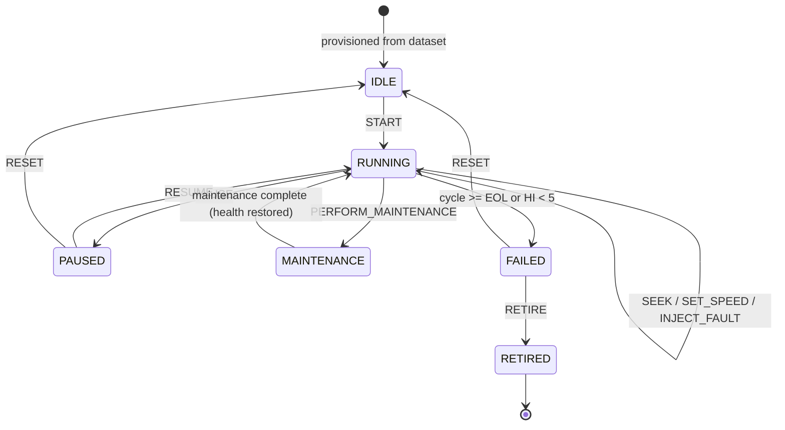

# 08 — Digital Twin Architecture

> The twin is the product. Everything else (models, agents, 3D) is a client of the twin.

## 8.1 Definition

A **DigitalTwin** is a server-side, event-sourced aggregate that mirrors one C-MAPSS engine unit. It
is a *hybrid* twin: **data-driven** (sensor replay + ML) fused with a thin **physics-informed** layer
(thermodynamic efficiency proxies) so that component-level health is explainable rather than invented.

Fidelity level: **Level 3 — Predictive Twin** on the common 5-level scale (descriptive → informative
→ predictive → prescriptive → autonomous). With the maintenance planner agent it reaches **Level 4
(prescriptive)**; autonomy (Level 5) is deliberately out of scope — a human approves every work package.

---

## 8.2 Twin state model

```python
@dataclass(frozen=True, slots=True)
class TwinState:
    engine_id: EngineId
    unit_number: int
    subset: Subset
    status: TwinStatus
    cycle: int
    seq: int  # monotonic event sequence
    wall_ts: datetime

    # raw + derived signal
    sensors: SensorVector  # 21 floats
    op_settings: tuple[float, float, float]
    regime: int  # 0..5
    sensor_baseline: SensorVector  # regime-conditional nominal
    residuals: SensorVector  # sensors - baseline (z-scored)

    # health
    health_index: float  # 0..100, EWMA-smoothed
    health_band: HealthBand
    component_health: dict[EngineModule, ComponentState]
    degradation_rate: float  # HI units per cycle, EMA over 20 cycles

    # prediction
    rul_p50: float | None
    rul_p10: float | None
    rul_p90: float | None
    failure_prob: dict[int, float]  # {30:…, 60:…, 90:…}
    prediction_model_id: str | None
    prediction_stale: bool
    attributions: list[Attribution]

    # anomaly
    anomaly_score: float
    active_anomalies: tuple[AnomalyRef, ...]

    # lifecycle
    total_cycles_seen: int
    maintenance_history: tuple[MaintenanceRef, ...]
    time_in_band: dict[HealthBand, int]
```

`ComponentState = {score: float, degradation_rate: float, drivers: list[str], last_maintained_cycle: int|None}`

---

## 8.3 Lifecycle FSM


Transition table is data, not `if`-chains: `ALLOWED: dict[(status, command), status]`. Invalid
commands emit `twin.command.rejected` with a reason (never throw).

---

## 8.4 Physics-informed layer (why this isn't a fake twin — R8)

C-MAPSS is generated by a real thermodynamic simulation, so its sensors obey turbofan physics. We
exploit that with **efficiency and flow-capacity proxies**, each a monotone function of a specific
module's degradation:

| Proxy | Formula (normalized per regime) | Physical meaning | Module |
|---|---|---|---|
| `η_HPC` | `1 − Δ(T30/T24)` vs healthy baseline | Compressor temperature rise above ideal ⇒ efficiency loss | HPC |
| `π_HPC` | `Δ(P30/P2)` | Pressure-ratio deterioration | HPC |
| `η_LPC` | `1 − Δ(T24/T2)` | LPC efficiency | LPC |
| `η_HPT` | `Δ(T50)` at constant `Nc` and fuel flow | Turbine gas-path deterioration, blade tip clearance | HPT |
| `Γ_cool` | `Δ(W31), Δ(W32)` | Coolant bleed drift ⇒ seal/clearance wear | HPT/LPT |
| `η_comb` | `Δ(phi)` & `Δ(farB)` at constant thrust | Fuel required for the same output ⇒ combustor/overall deterioration | COMBUSTOR |
| `η_fan` | `Δ(Nf − NRf)` & `Δ(BPR)` | Fan aero deterioration | FAN |
| `EPR_drift` | `Δ(epr)` | Overall thrust-producing capability | GLOBAL/NOZZLE |

Each proxy is computed as a **deviation from the unit's own healthy baseline** (first 20 cycles,
regime-conditional), so unit-to-unit manufacturing scatter cancels out. Deviations are converted to
0–100 component scores via a calibrated logistic map whose parameters are fit once, offline, so that
a component score of 50 corresponds to the population median deterioration at 50 % of life.

Component health is therefore **derived from measurable thermodynamic degradation**, not a made-up
weighted sum — this is the answer to "how do you know the HPC is at 62 %?"

---

## 8.5 Sensor → module attribution matrix

Used by XAI, anomaly attribution, and the 3D hotspots. Rows sum to 1.

| Sensor | FAN | LPC | HPC | COMB | HPT | LPT | NOZZLE |
|---|---|---|---|---|---|---|---|
| s2 (T24) | 0.2 | **0.8** | | | | | |
| s3 (T30) | | 0.1 | **0.9** | | | | |
| s4 (T50) | | | 0.1 | 0.2 | **0.5** | 0.2 | |
| s7 (P30) | | 0.1 | **0.9** | | | | |
| s8 (Nf) | **0.8** | 0.2 | | | | | |
| s9 (Nc) | | | 0.5 | | **0.5** | | |
| s11 (Ps30) | | 0.1 | **0.9** | | | | |
| s12 (phi) | | | 0.2 | **0.7** | 0.1 | | |
| s13 (NRf) | **0.8** | 0.2 | | | | | |
| s14 (NRc) | | | **0.6** | | 0.4 | | |
| s15 (BPR) | **0.6** | 0.2 | 0.2 | | | | |
| s17 (htBleed) | | | **0.7** | 0.2 | 0.1 | | |
| s20 (W31) | | | 0.2 | | **0.8** | | |
| s21 (W32) | | | 0.1 | | 0.2 | **0.7** | |
| s10 (epr) | 0.2 | 0.1 | 0.2 | 0.1 | 0.2 | 0.1 | 0.1 |

Module anomaly score = Σ(|z_sensor| × weight). The dominant module drives the 3D hotspot.

---

## 8.6 Health Index fusion

```
HI_raw = 100 × ( w1·D + w2·R + w3·A + w4·C )      with Σw = 1
  D = physics degradation term  = mean of normalized component scores (weighted by criticality)
  R = model term                = clamp(rul_p50 / R_early, 0, 1)
  A = anomaly term              = 1 − clamp(anomaly_score / 4σ, 0, 1)
  C = worst-component term      = min(component_scores) / 100

default weights: w1=0.30, w2=0.40, w3=0.15, w4=0.15
HI_t = α·HI_raw + (1−α)·HI_{t−1}          α = 0.25   (EWMA)
HI_t = min(HI_t, HI_{t−1} + 0.5)          # monotonic-decay constraint, except after maintenance
```

**Why the monotonic constraint:** real gas-path deterioration is not self-healing; without it, sensor
noise makes the fleet dashboard flicker between bands, which looks amateurish. Maintenance events
explicitly lift the ceiling. `w2 = 0.40` keeps the ML model influential without letting a single bad
inference flip a band (bands additionally require **3 consecutive cycles** in the new band to latch —
hysteresis).

Criticality weights for the component-weighted mean: HPT 0.22, HPC 0.22, COMBUSTOR 0.16, LPT 0.14,
FAN 0.12, LPC 0.09, NOZZLE 0.05.

---

## 8.7 Event catalogue (append-only)

| Event | Payload | Emitted when |
|---|---|---|
| `twin.provisioned` | spec | seed |
| `twin.started` / `paused` / `resumed` / `reset` | — | command |
| `twin.cycle.advanced` | cycle, sensors, regime | every tick (not persisted individually; folded into telemetry) |
| `twin.health.updated` | hi, band, components | every tick (coalesced) |
| `twin.health.band_changed` | from, to, hi, drivers | band latch |
| `twin.component.degraded` | module, score, rate, drivers | component crosses threshold |
| `twin.prediction.updated` | rul p10/p50/p90, probs, model_id | inference returns |
| `twin.prediction.stale` | last_ok_ts | circuit breaker open |
| `twin.anomaly.detected` | detector, score, sensors, module | detector fires |
| `twin.anomaly.resolved` | anomaly_id | score returns below threshold for 10 cycles |
| `twin.regime.changed` | from, to | regime cluster switch |
| `twin.maintenance.performed` | module, action, hi_before/after | command |
| `twin.failed` | cycle, final_hi, cause | EOL |
| `twin.retired` | — | command |
| `twin.command.rejected` | command, reason | invalid FSM transition |
| `twin.simulation.completed` | sim_id, summary | sandbox finishes |
| `twin.engine.lag` | lag_ms, shard | loop overrun |

Snapshot every 50 cycles or on any `band_changed`/`failed`/`maintenance` event.

---

## 8.8 Replay engine

- **Virtual clock:** `cycle(t) = floor((t − t0) × speed / cycle_duration_ms)`, `cycle_duration_ms = 1000`.
  Global speed multiplier ∈ {0.5, 1, 2, 4, 8, 16, 32}; per-engine override allowed.
- **Fleet phase offset:** engines start at randomized cycle offsets so the fleet shows a realistic
  mix of new/mid-life/near-failure engines from second one — critical for a good demo.
- **End of trajectory policy:** `FAIL_AND_HOLD` (default, becomes `FAILED`), `LOOP` (reset to cycle 1,
  new tail number), or `RETIRE`. Configurable per fleet.
- **Seek:** rebuild state by replaying from the nearest snapshot; O(50 cycles) worst case.
- **Determinism:** identical seed + speed + commands ⇒ identical event log. Asserted in tests.

---

## 8.9 Simulation sandbox (what-if) — P8

```
POST /engines/{id}/simulate
  { base_cycle, horizon_cycles: 100,
    scenario: { interventions: [
        {type:"sensor_bias",  target:"s3", magnitude:+8.0, unit:"degR", start:0},
        {type:"regime_shift", target:"regime", to:5, start:10},
        {type:"maintenance_delay", cycles:40},
        {type:"cycle_extension", extra_cycles:50},
        {type:"maintenance_action", module:"HPC", effectiveness:0.7, at:20}
    ]}}
```

Execution:
1. Deep-copy twin state at `base_cycle` into a **sandbox twin** (no bus, no DB writes to live tables).
2. Roll forward `horizon_cycles` using a **degradation propagation model**:
   - sensors extrapolated by the fitted per-unit exponential/linear degradation trend (fit on last 30 cycles),
   - plus scenario interventions,
   - plus stochastic noise (seeded) → run **50 Monte-Carlo paths**.
3. Score every path with the RUL model each cycle.
4. Return baseline vs scenario: median trajectory + 10/90 bands, failure-cycle distribution,
   `Δ RUL`, `Δ failure_prob`, first cycle crossing CRITICAL, and a cost delta from the maintenance model.

The UI overlays baseline (grey) vs scenario (accent) with a shaded band, plus a plain-language delta
summary. Simulation results are persisted so they can be cited later by the copilot.

---

## 8.10 Maintenance effect model
`PERFORM_MAINTENANCE(module, action)` restores that component by an effectiveness factor
(`inspect` 0.05, `clean/wash` 0.25, `repair` 0.6, `overhaul/replace` 0.98) toward 100, releases the
monotonic ceiling, resets the module's baseline, and logs `maintenance_events` with
`health_before/after`. Fleet-level, this lets the demo show *"we washed the HPC and RUL improved by
28 cycles"* — with the caveat, stated in the report, that the restoration model is heuristic since
C-MAPSS contains no maintenance actions.

---

## 8.11 Twin ↔ 3D binding
| Twin field | 3D effect |
|---|---|
| `component_health[M]` | module mesh color + emissive + roughness |
| `sensors.s8 (Nf)` | fan rotation speed |
| `health_band == CRITICAL` | pulse ring + red rim light |
| `active_anomalies[].module` | hotspot billboard, pulsing |
| `status == FAILED` | desaturate, smoke particle puff, halt fan |
| `status == MAINTENANCE` | exploded view auto-trigger, amber scaffolding overlay |
| `regime` | subtle HDRI/background shift (sea level vs altitude) |
