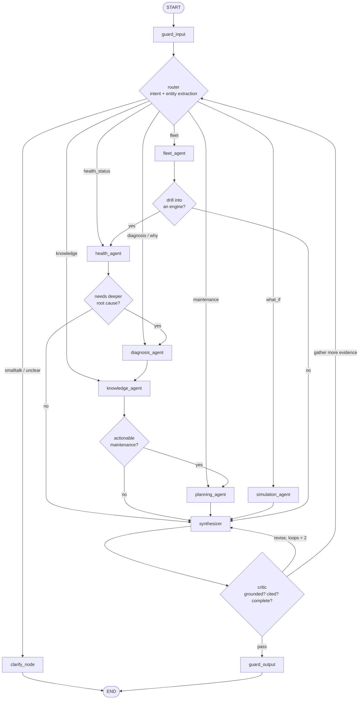

# 09 — Multi-Agent Architecture (LangGraph + MCP)

## 9.1 Design philosophy

- **Supervisor–specialist topology**, not a free-for-all chat. Deterministic, testable, drawable.
- **Agents are stateless functions over `AgentState`.** All memory is explicit in state or in the DB.
- **Agents never touch the database.** Only MCP tools (P3). The tool layer is the audit + security boundary.
- **Every agent has a deterministic fallback** so the platform works with `LLM_PROVIDER=none` (P4).
- **Everything is traced**: every node, prompt version, token count, tool call, and citation is persisted.

---

## 9.2 The seven agents

| # | Agent | Mission | MCP tools | Deterministic fallback |
|---|---|---|---|---|
| 1 | **Health Monitoring** | Continuously assess a twin's condition; classify severity; decide whether escalation is warranted | `get_twin_state`, `get_component_health`, `get_sensor_history`, `get_anomalies`, `get_prediction` | Rule engine over HI/band/anomaly thresholds |
| 2 | **Failure Diagnosis** | Root-cause analysis: which module, which failure mode, what evidence, what confidence | `get_sensor_history`, `get_component_health`, `get_anomalies`, `rag_search`, `find_procedure`, `compare_engines` | Attribution-matrix argmax + fault-mode lookup table |
| 3 | **Maintenance Planning** | Turn a diagnosis into a scheduled, costed, regulation-aware work package | `get_prediction`, `get_task_card`, `lookup_part`, `get_maintenance_slots`, `estimate_cost`, `check_regulatory_requirement`, `create_work_package` | Severity→action policy table + slot-fit heuristic |
| 4 | **Engineering Copilot** | Conversational front door; understands intent, delegates, synthesizes, cites | (delegates; may call `rag_search` directly for pure-knowledge questions) | Template answers from twin state |
| 5 | **Simulation** | Translate a natural-language what-if into a `ScenarioSpec`, run it, interpret the delta | `get_twin_state`, `run_simulation` | Slot-filling parser for a fixed grammar |
| 6 | **Fleet Management** | Fleet-wide reasoning: ranking, clustering of similar degradation, capacity/priority tradeoffs | `query_fleet`, `compare_engines`, `get_maintenance_slots` | Sorting + priority formula (§9.9) |
| 7 | **Knowledge Retrieval** | Hybrid retrieval, reranking, citation packaging; the only agent allowed to introduce external facts | `rag_search`, `manual_lookup`, `get_chunk`, `list_sources` | BM25-only retrieval, no synthesis |

Additional non-agent nodes: **Router** (intent classification), **Critic** (verification loop),
**Synthesizer** (final composition), **Guard** (I/O safety).

---

## 9.3 LangGraph topology



Config: `recursion_limit=18`, per-run budget 12 k tokens / 25 s wall, `interrupt_before=["planning_agent"]`
when the request would create a work package **and** the user is not a `planner` (human-in-the-loop).

---

## 9.4 Shared state

```python
class AgentState(TypedDict):
    # input
    query: str
    conversation_id: UUID
    run_id: UUID
    user_role: str
    engine_context: EngineId | None

    # routing
    intent: Intent  # HEALTH|DIAGNOSIS|MAINTENANCE|WHATIF|FLEET|KNOWLEDGE|CLARIFY
    entities: dict  # {engine_ids, modules, horizon_cycles, sensors, timeframe}
    plan: list[str]  # node names the router intends to visit

    # working memory
    evidence: list[Evidence]  # {source_type, content, ref, confidence, tool_call_id}
    tool_calls: list[ToolCallRecord]
    drafts: dict[str, str]  # per-agent partial outputs
    citations: list[Citation]

    # control
    critic_loops: int
    tokens_used: int
    deadline: datetime
    degraded: bool  # true if LLM unavailable → template mode
    errors: list[AgentError]

    # output
    answer: str
    confidence: float
    followups: list[str]
    artifacts: list[Artifact]  # work package draft, sim result, chart spec
```

`Evidence` is the unit of grounding: every sentence the synthesizer writes must trace to one or more
`Evidence` items, and each is either a **tool fact** (numeric, from the twin) or a **document chunk**
(citable). The critic enforces this.

---

## 9.5 Agent contracts (input → output)

**Health Monitoring**
in: `engine_id` → out: `{band, hi, trend, top_degraded_modules[], anomaly_summary, escalate: bool, rationale}`

**Failure Diagnosis**
in: `engine_id, symptoms/evidence` → out: `{primary_module, failure_mode, confidence, evidence_chain[], differential[] (ranked alternates), recommended_inspections[]}`
Fault-mode vocabulary: `HPC_EFFICIENCY_LOSS`, `HPC_FLOW_CAPACITY_LOSS`, `FAN_DEGRADATION`,
`HPT_BLADE_TIP_CLEARANCE`, `COOLING_BLEED_DRIFT`, `COMBUSTOR_INEFFICIENCY`, `SENSOR_FAULT`, `UNKNOWN`.
(Note: FD001/FD002 have one true fault mode (HPC), FD003/FD004 two (HPC + Fan) — the diagnosis agent
is evaluated against this ground truth.)

**Maintenance Planning**
in: `diagnosis, rul, fleet slots` → out: `WorkPackage{title, severity, tasks[] (with AMM task codes),
parts[], labor_hours, downtime_h, cost_usd, due_by_cycle, slot_recommendation, regulatory_refs[], rationale}`
Always `status = DRAFT` — a human approves (Level-4, not Level-5 autonomy).

**Simulation** in: NL what-if → out: `ScenarioSpec` + interpreted result narrative.
**Fleet** in: filter/goal → out: ranked table + cohort insights + capacity conflicts.
**Knowledge** in: query + filters → out: `Evidence[]` with chunk ids, quotes, relevance.
**Copilot** in: everything → out: final answer, citations, follow-ups, artifacts.

---

## 9.6 MCP layer

Three servers (Doc 03 §3.9). Every tool declares JSON-Schema in/out and a `read_only` flag.

```json
{
  "name": "get_sensor_history",
  "description": "Return sensor time-series for one engine over a cycle range, optionally downsampled.",
  "read_only": true,
  "inputSchema": {"type":"object","required":["engine_ref","sensors"],
    "properties":{
      "engine_ref":{"type":"string","description":"UUID or external ref e.g. FD001-train-U27"},
      "sensors":{"type":"array","items":{"type":"string","pattern":"^s([1-9]|1[0-9]|2[01])$"},"maxItems":8},
      "from_cycle":{"type":"integer","minimum":1},
      "to_cycle":{"type":"integer"},
      "max_points":{"type":"integer","default":200,"maximum":1000}}},
  "outputSchema": {"...": "series[] with cycle, value, baseline, zscore"}
}
```

Guarantees: ≤ 2 s budget, results truncated to a token cap (tables summarized, not dumped), errors
returned as structured tool errors the agent can reason about (`{"error":"ENGINE_NOT_FOUND", "hint":...}`),
and **every call persisted** to `agent_tool_calls` with arguments, result, duration, ok.

Transport: stdio in dev (fast, simple), HTTP+SSE in Docker (independently scalable).

---

## 9.7 LLM abstraction & degradation

```
LLMProvider(Protocol):
    async def complete(messages, tools=None, **kw) -> Completion
    async def stream(messages, tools=None, **kw) -> AsyncIterator[Delta]
```
Implementations: `OpenAIProvider` (gpt-4o-mini class), `GroqProvider` (llama-3.3-70b),
`OllamaProvider` (qwen2.5:7b local), `NullProvider`.

`NullProvider` doesn't fail — it routes each node to its deterministic fallback and sets
`state.degraded = True`. The UI shows an "offline reasoning mode" badge. **The demo can therefore
run on a plane with no internet** (NFR-10). This is a deliberate, defensible engineering decision,
not a limitation.

Cost control: response cache (Redis, prompt-hash key), token budget per run, cheap model for routing
and critic, stronger model only for synthesis.

---

## 9.8 Memory

| Type | Store | Content | Lifetime |
|---|---|---|---|
| Working | `AgentState` | current run evidence | one run |
| Short-term | `messages` table, last 10 turns | conversation | one conversation |
| Rolling summary | `conversations.summary` | LLM-compressed history | one conversation |
| Entity memory | Redis hash per conversation | engines/modules/facts mentioned → enables "and the other one?" | 24 h |
| Long-term semantic | Chroma `fleet_history` | past diagnoses + outcomes, embedded | forever |
| Graph checkpoints | Postgres (LangGraph) | resumable/replayable runs | 30 d |

---

## 9.9 Deterministic fallback logic (must be strong on its own)

**Priority score** (used by Fleet agent and the dashboard sort):
```
priority = 0.40·(1 − RUL_norm)          RUL_norm = clamp(rul_p50/125,0,1)
         + 0.25·(1 − HI/100)
         + 0.15·anomaly_pressure
         + 0.10·criticality(worst_module)
         + 0.10·(1 − slot_availability_within_RUL)
```
**Severity policy:** CRITICAL → ground before next cycle, borescope + likely HPC overhaul.
WARNING → schedule within `min(rul_p10, 30)` cycles, water-wash + gas-path analysis.
WATCH → monitor, trend review in 10 cycles. HEALTHY → routine.

These tables also serve as the LLM's few-shot scaffolding, which keeps LLM answers consistent with
the deterministic path.

---

## 9.10 Safety, guards, evaluation

**Input guard:** injection heuristics ("ignore previous", tool-name mentions, base64 blobs), length cap,
PII scrub. Retrieved chunks are wrapped as untrusted data with explicit delimiters.
**Output guard:** JSON-schema validation of structured artifacts; citation-existence check; numeric
cross-check (any number in the answer must appear in an `Evidence` item or be derivable); refusal to
state airworthiness determinations as fact — always framed as *decision support* with a disclaimer.

**Eval suite (`services/agent_runtime/evals/`):**
- 40 golden questions × 7 intents, with expected tool sets and expected key facts.
- Metrics: intent accuracy, tool-selection F1, citation precision/recall, faithfulness (ragas),
  answer completeness (rubric-scored by a judge model), p95 latency, tokens/run.
- Regression gate in CI: no metric may drop > 5 % vs the recorded baseline.

---

## 9.11 Autonomous (non-chat) agent triggers

The system is not only reactive:
| Trigger | Agent | Action |
|---|---|---|
| `twin.health.band_changed → WARNING/CRITICAL` | Health → Diagnosis | Auto-generate a diagnosis, attach to engine timeline, push a UI notification |
| `twin.anomaly.detected (severity ≥ HIGH)` | Diagnosis | Explain the anomaly, attribute a module |
| Diagnosis confidence ≥ 0.7 and severity ≥ HIGH | Planning | Draft a work package (status DRAFT, awaits approval) |
| Every 500 fleet cycles | Fleet | Fleet health digest posted to the dashboard |
| `model.drift.detected` | Fleet | Flag degraded prediction trust |

This is what makes it *agentic* rather than *a chatbot* — and it's visible in the UI as agent-authored
cards appearing on their own.
