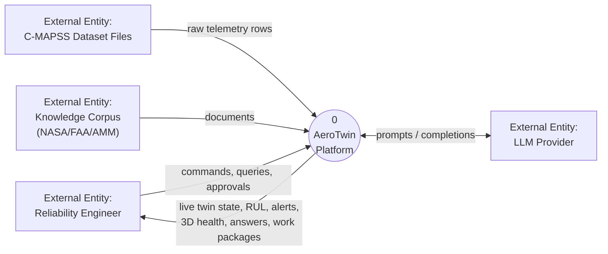
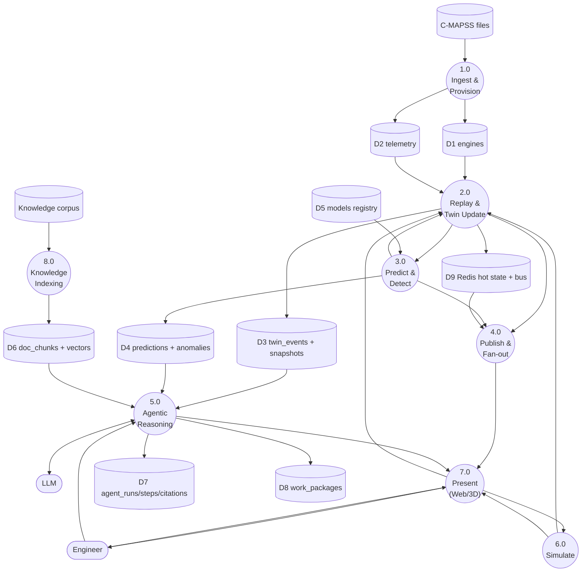
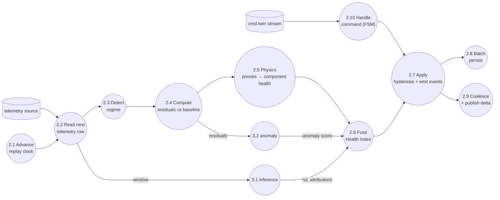
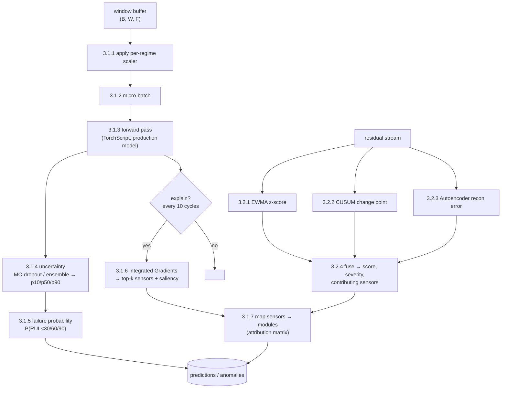
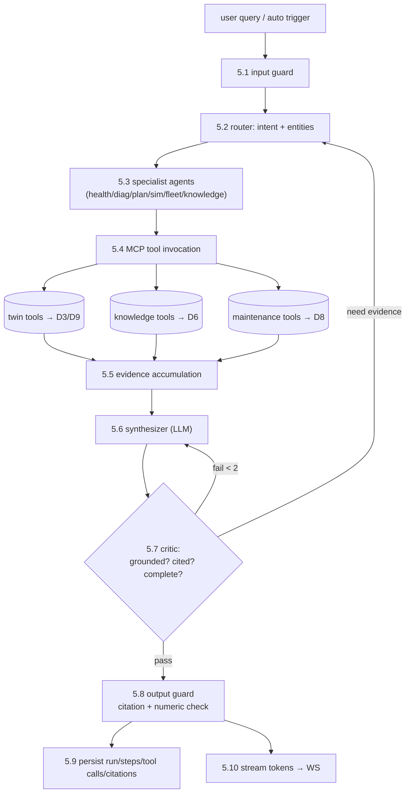

# 10 — Data Flow Diagrams

## 10.1 Level 0 — Context DFD

---

## 10.2 Level 1 — Major processes

**Process definitions**

| ID | Process | Input | Output | Store touched |
|---|---|---|---|---|
| 1.0 | Ingest & Provision | raw txt | engine rows, parquet, seeded fleet | D1, D2 |
| 2.0 | Replay & Twin Update | telemetry row, commands | twin state, events, deltas | D2, D3, D9 |
| 3.0 | Predict & Detect | window tensor | RUL, intervals, attributions, anomalies | D4, D5 |
| 4.0 | Publish & Fan-out | deltas | WS frames per channel | D9 |
| 5.0 | Agentic Reasoning | query/trigger + evidence | answer, citations, work package | D3,D4,D6,D7,D8 |
| 6.0 | Simulate | scenario spec | trajectories, deltas | D3 (read), simulations |
| 7.0 | Present | WS frames + REST | rendered UI, 3D | — |
| 8.0 | Knowledge Indexing | documents | chunks + embeddings | D6 |

---

## 10.3 Level 2 — Process 2.0 (Replay & Twin Update)

---

## 10.4 Level 2 — Process 3.0 (Predict & Detect)

---

## 10.5 Level 2 — Process 5.0 (Agentic Reasoning)

---

## 10.6 Data dictionary (selected flows)

| Flow | Schema | Rate |
|---|---|---|
| `telemetry_row` | `{unit, cycle, op[3], s[21]}` | speed × 1/s per engine |
| `twin_delta` | `{engine_id, cycle, hi, band, components{}, rul{}, anomaly, sensors_subset{}}` | ≤ 4 Hz per engine (coalesced) |
| `fleet_delta` | `{counts_by_band, avg_hi, at_risk[], changed[]}` | 1 Hz |
| `inference_request` | `{model_id, windows: f32[B][W][F], mask, explain}` | 1/tick batched |
| `inference_response` | `{rul_p10/p50/p90[], probs[], attributions[]?, latency_ms}` | 1/tick |
| `agent_token` | `{run_id, delta, index}` | ~30–80/s during synthesis |
| `evidence_item` | `{source_type, ref, content, confidence, tool_call_id}` | per tool call |
