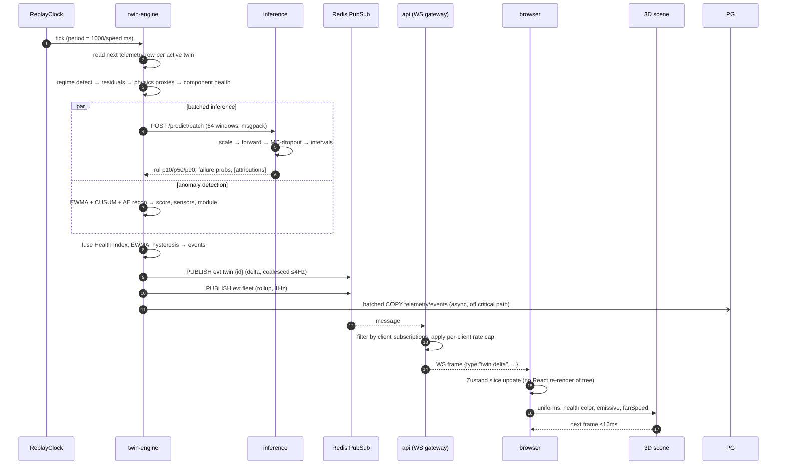
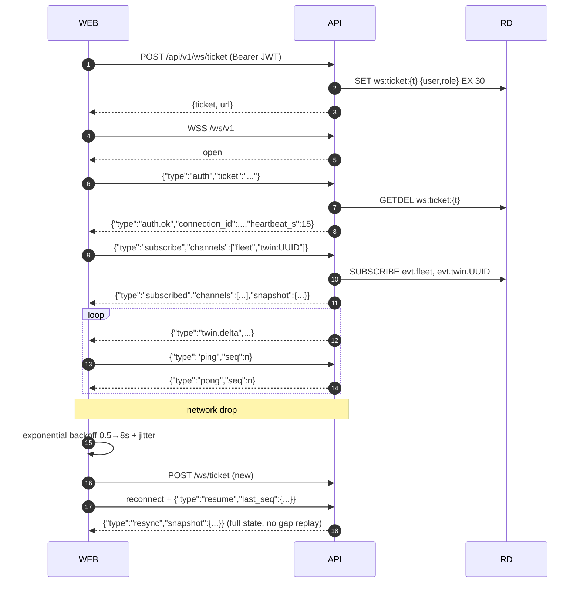
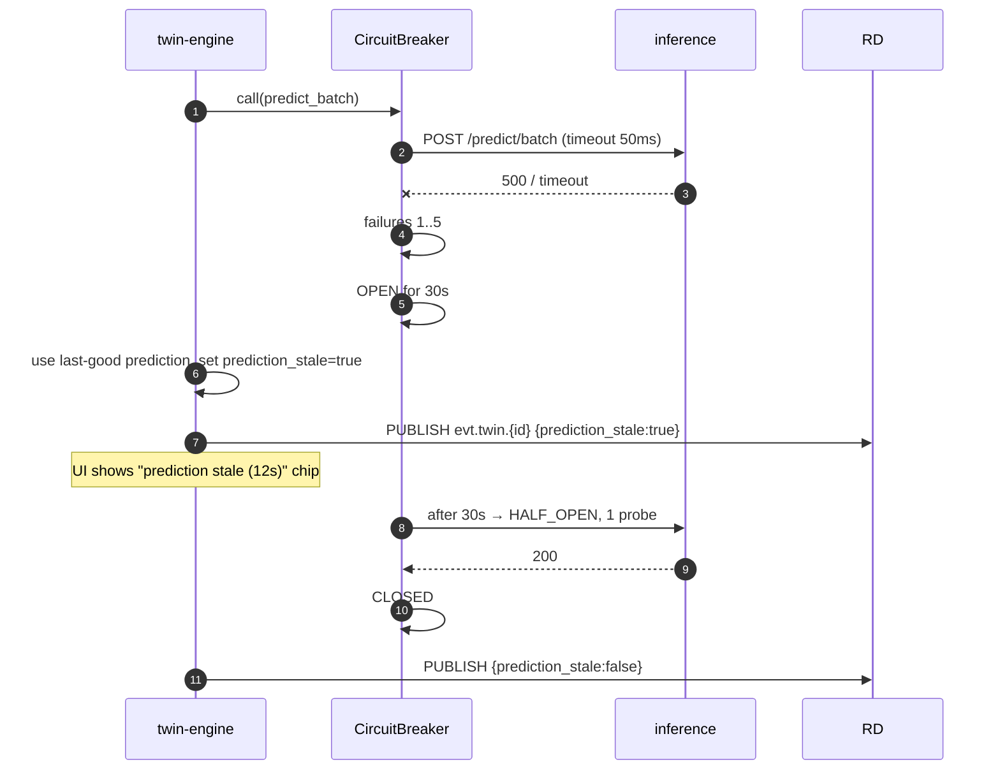
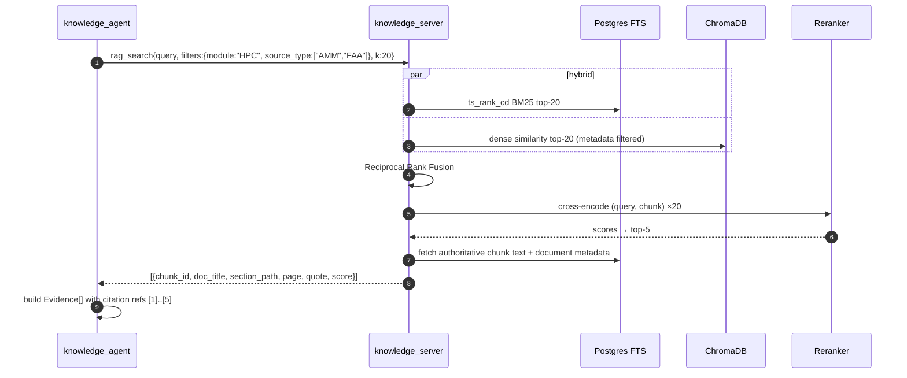
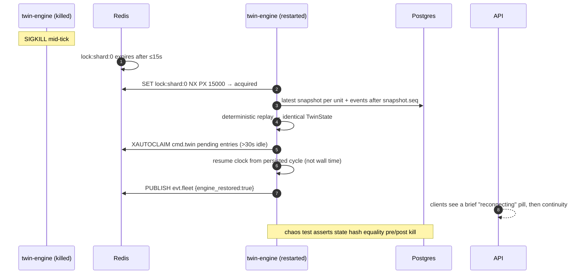

# 11 — Sequence Diagrams

Twelve canonical flows. These are the contracts implementation must satisfy.

---

## 11.1 SEQ-01 — Cold start: boot & rehydrate

```mermaid
sequenceDiagram
    autonumber
    participant OP as Operator (make demo)
    participant PG as Postgres
    participant RD as Redis
    participant TE as twin-engine
    participant INF as inference
    participant API as api
    participant WEB as web

    OP->>PG: alembic upgrade head; seed engines/models/docs
    OP->>INF: start → load PRODUCTION TorchScript per subset, warmup 20 fwd passes
    INF-->>OP: /health/ready 200
    OP->>TE: start (SHARD_INDEX=0, SHARD_COUNT=1)
    TE->>RD: SET lock:shard:0 NX PX 15000
    TE->>PG: SELECT latest twin_snapshots for shard units
    TE->>PG: SELECT twin_events WHERE seq > snapshot.seq
    TE->>TE: replay events → in-memory TwinState registry
    TE->>RD: HSET twin:{id}:state (hot cache) ×N
    TE-->>OP: ready, 260 twins IDLE
    OP->>API: start
    API->>PG: pool; API->>RD: pool
    API-->>OP: /health/ready 200
    OP->>WEB: start
    WEB->>API: GET /api/v1/fleet
    API-->>WEB: 200 fleet page 1
```

---

## 11.2 SEQ-02 — Real-time tick → browser paint (the core loop)



---

## 11.3 SEQ-03 — Health band crosses to CRITICAL → autonomous agent chain

```mermaid
sequenceDiagram
    autonumber
    participant TE as twin-engine
    participant RD as Redis
    participant AR as agent-runtime
    participant MCP as MCP servers
    participant LLM as LLM
    participant PG as Postgres
    participant API as api
    participant WEB as browser

    TE->>TE: HI 36.4 → 34.1, 3 consecutive cycles → band CRITICAL latched
    TE->>RD: PUBLISH evt.twin.{id} {band_changed}
    TE->>RD: XADD cmd.agent {trigger:auto_health, engine_id, run_id}
    AR->>RD: XREADGROUP → claim
    AR->>PG: INSERT agent_runs (RUNNING)
    AR->>AR: guard_input → router (intent=HEALTH, entity=engine)
    AR->>MCP: get_twin_state, get_component_health, get_anomalies, get_prediction
    MCP-->>AR: evidence (HPC 41%, W31 drift +3.2σ, RUL p50=19)
    AR->>AR: health_agent → escalate=true
    AR->>MCP: get_sensor_history(s3,s11,s17,s20, last 60 cycles)
    AR->>LLM: diagnosis prompt + evidence
    LLM-->>AR: HPC_EFFICIENCY_LOSS, confidence 0.82
    AR->>MCP: rag_search("HPC efficiency loss borescope AMM 72-31")
    MCP-->>AR: 5 chunks + citations
    AR->>MCP: get_task_card, lookup_part, estimate_cost, get_maintenance_slots
    AR->>LLM: planning prompt
    LLM-->>AR: WorkPackage draft
    AR->>MCP: create_work_package (status DRAFT)
    MCP->>PG: INSERT work_packages + tasks
    AR->>AR: synthesizer → critic (grounded ✓ cited ✓) → guard_output
    AR->>PG: UPDATE agent_runs COMPLETED; INSERT steps/tool_calls/citations
    AR->>RD: PUBLISH evt.agent.{run_id} {completed} ; PUBLISH evt.fleet {notification}
    RD-->>API: message
    API-->>WEB: WS {type:"notification", severity:"CRITICAL", work_package_id}
    WEB->>WEB: toast + engine card badge + timeline card appears
```

---

## 11.4 SEQ-04 — Copilot question with streaming

```mermaid
sequenceDiagram
    autonumber
    actor U as Engineer
    participant WEB as browser
    participant API as api
    participant PG as Postgres
    participant RD as Redis
    participant AR as agent-runtime
    participant MCP as MCP
    participant LLM as LLM

    U->>WEB: "Why is Engine 27 unhealthy and can it fly 50 more cycles?"
    WEB->>API: POST /api/v1/copilot/ask {conversation_id, engine_id, message}
    API->>PG: INSERT messages(user), INSERT agent_runs(RUNNING)
    API->>RD: XADD cmd.agent
    API-->>WEB: 202 {run_id}
    WEB->>API: WS subscribe channel agent:{run_id}
    AR->>RD: consume
    AR->>RD: PUBLISH step.started(router)
    AR->>AR: intent = DIAGNOSIS + WHATIF (compound) → plan [diag, knowledge, sim, synth]
    loop each tool call
        AR->>MCP: tool(args)
        MCP-->>AR: result
        AR->>RD: PUBLISH tool.call {server, tool, args, ms}
        RD-->>API: → WEB (tool trace viewer updates live)
    end
    AR->>MCP: run_simulation{horizon:50, scenario: no intervention}
    MCP-->>AR: P(fail within 50) = 0.71
    AR->>LLM: stream synthesis
    loop tokens
        LLM-->>AR: delta
        AR->>RD: PUBLISH agent.token
        RD-->>API: →
        API-->>WEB: WS token
        WEB->>WEB: append to StreamingMarkdown
    end
    AR->>AR: critic pass → guard_output (citations resolve ✓)
    AR->>PG: INSERT messages(assistant), citations; UPDATE run COMPLETED
    AR->>RD: PUBLISH run.completed {confidence, followups}
    API-->>WEB: WS completed → render citation chips + "Create work package?" CTA
```

---

## 11.5 SEQ-05 — What-if simulation

```mermaid
sequenceDiagram
    autonumber
    actor U
    participant WEB
    participant API
    participant PG
    participant RD
    participant TE as twin-engine (sandbox)
    participant INF as inference

    U->>WEB: ScenarioBuilder: +8°R on T30, delay maintenance 40 cycles, horizon 100
    WEB->>API: POST /engines/{id}/simulate
    API->>API: validate ScenarioSpec (zod/pydantic), RBAC, rate limit
    API->>PG: INSERT simulations (PENDING)
    API->>RD: XADD cmd.twin {type:SIMULATE, sim_id}
    API-->>WEB: 202 {simulation_id} + subscribe sim:{id}
    TE->>TE: fork TwinState at base_cycle (sandboxed, no live writes)
    loop 50 Monte-Carlo paths × 100 cycles
        TE->>TE: extrapolate degradation + apply interventions + seeded noise
        TE->>INF: batched score
        INF-->>TE: RUL
    end
    TE->>TE: aggregate median + p10/p90, failure-cycle distribution, Δ vs baseline
    TE->>PG: UPDATE simulations DONE (baseline, scenario, delta_summary)
    TE->>RD: PUBLISH evt.sim.{id} {done}
    RD-->>API-->>WEB: WS done
    WEB->>API: GET /simulations/{id}
    API-->>WEB: full result
    WEB->>WEB: overlay baseline vs scenario + delta cards
```

---

## 11.6 SEQ-06 — WebSocket connect, auth, subscribe, reconnect



---

## 11.7 SEQ-07 — Fleet dashboard load & live sort

```mermaid
sequenceDiagram
    autonumber
    participant WEB
    participant API
    participant RD
    participant PG

    WEB->>API: GET /fleet?sort=priority&order=desc&page=1&size=50
    API->>RD: ZREVRANGE fleet:rank:priority 0 49
    RD-->>API: 50 engine ids
    API->>RD: pipeline HGETALL twin:{id}:state ×50
    alt cache miss
        API->>PG: SELECT latest snapshots for missing ids
    end
    API-->>WEB: 200 {items, total, aggregates}
    WEB->>API: WS subscribe "fleet"
    loop 1 Hz
        API-->>WEB: {"type":"fleet.delta","changed":[{id,hi,band,rul,priority}]}
        WEB->>WEB: patch Zustand map; re-sort only if sortKey affected; virtualized rows update
    end
```

---

## 11.8 SEQ-08 — Model inference with circuit breaker



---

## 11.9 SEQ-09 — RAG retrieval inside the knowledge agent



---

## 11.10 SEQ-10 — Maintenance approval (human-in-the-loop)

```mermaid
sequenceDiagram
    autonumber
    actor P as Planner
    participant WEB
    participant API
    participant PG
    participant RD
    participant TE as twin-engine

    P->>WEB: open WorkPackageBoard → review DRAFT WP-1042 (rationale + citations + cost)
    P->>WEB: Approve, schedule slot 2026-08-03
    WEB->>API: POST /maintenance/work-packages/{id}/approve {slot}
    API->>API: RBAC require role=planner; status transition guard DRAFT→APPROVED
    API->>PG: UPDATE work_packages; INSERT audit row
    API->>RD: XADD cmd.twin {type:PERFORM_MAINTENANCE, module:HPC, effectiveness:0.6, at_cycle:next}
    API-->>WEB: 200 {status:APPROVED}
    TE->>TE: at next tick apply maintenance effect → component restored, ceiling released
    TE->>PG: INSERT maintenance_events (health_before 34.1 → after 71.8)
    TE->>RD: PUBLISH evt.twin.{id} {maintenance.performed}
    RD-->>API-->>WEB: WS → 3D exploded view animation + health bar rises + timeline entry
```

---

## 11.11 SEQ-11 — Deep explanation on demand (XAI)

```mermaid
sequenceDiagram
    autonumber
    actor U
    participant WEB
    participant API
    participant INF
    participant RD

    U->>WEB: XaiPanel → "Explain deeply" (KernelSHAP)
    WEB->>API: POST /engines/{id}/explain {cycle, method:"shap"}
    API->>RD: GET explain-cache {engine,cycle,method}
    alt hit
        RD-->>API: cached
    else miss
        API->>INF: POST /explain {window, method:"shap", nsamples:200}
        INF->>INF: KernelSHAP (~1.5s)
        INF-->>API: shapley values (W×F)
        API->>RD: SETEX cache 1h
    end
    API-->>WEB: {top_sensors[], temporal_saliency[][], module_attribution{}, narrative}
    WEB->>WEB: bar chart + heatstrip; 3D highlights the attributed module
```

---

## 11.12 SEQ-12 — Crash recovery of twin-engine


